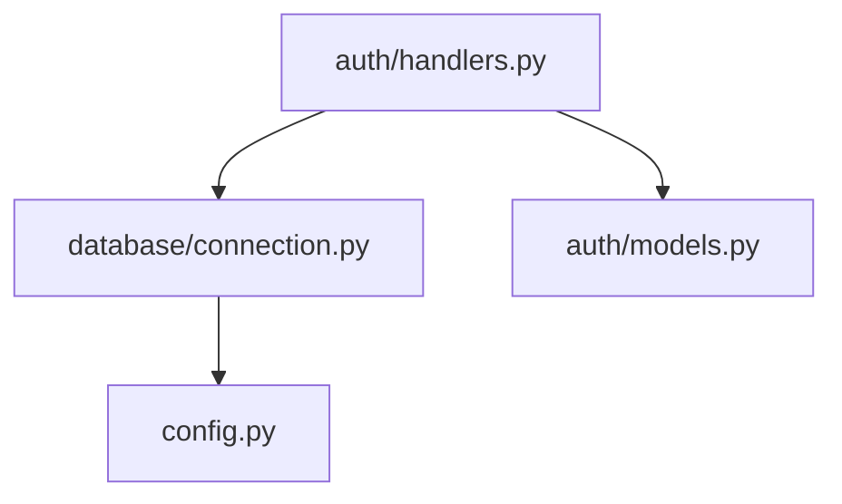

# Implementation Plans: FEAT-042 through FEAT-048

This document contains concise implementation plans for features 042-048.

---

## FEAT-042: Advanced Memory Search Filters

**Priority:** 🔥🔥 | **Estimate:** 2-3 days

### Objective
Extend `retrieve_memories` with advanced filtering: date ranges, tag logic (AND/OR), provenance, exclusions.

### Key Changes

**Models (`src/core/models.py`):**
```python
@dataclass
class AdvancedSearchFilters:
    # Date filtering
    created_after: Optional[datetime] = None
    created_before: Optional[datetime] = None
    updated_after: Optional[datetime] = None
    updated_before: Optional[datetime] = None
    accessed_after: Optional[datetime] = None

    # Tag logic
    tags_any: Optional[List[str]] = None  # Match ANY tag
    tags_all: Optional[List[str]] = None  # Match ALL tags
    tags_none: Optional[List[str]] = None  # Exclude these tags

    # Exclusions
    exclude_categories: Optional[List[MemoryCategory]] = None
    exclude_projects: Optional[List[str]] = None

    # Provenance (if implemented)
    min_trust_score: Optional[float] = None
    source: Optional[str] = None
```

**Implementation:**
1. Extend QueryRequest model with advanced filters
2. Update both store backends to support new filters
3. Add filter validation
4. Update retrieve_memories to pass filters through
5. Test all filter combinations

**Testing:** 15+ tests covering filter combinations

**Impact:** Power users can construct precise queries like:
- "Python memories from last week, NOT tagged 'deprecated'"
- "High-importance facts created this month"

---

## FEAT-043: Bulk Memory Operations

**Priority:** 🔥🔥 | **Estimate:** 2-3 days

### Objective
Enable bulk deletion of memories based on criteria, with dry-run mode.

### Key Components

**MCP Tool:**
```python
async def bulk_delete_memories(
    category: Optional[str] = None,
    context_level: Optional[str] = None,
    older_than_days: Optional[int] = None,
    tags: Optional[List[str]] = None,
    min_importance: Optional[float] = None,
    max_importance: Optional[float] = None,
    dry_run: bool = True,  # Default to safe mode
    max_deletions: int = 1000  # Safety limit
) -> Dict[str, Any]:
    """
    Delete multiple memories matching criteria.

    Returns:
        {
            "matched_count": int,
            "deleted_count": int,
            "dry_run": bool,
            "memory_ids": List[str],  # If dry_run
            "message": str
        }
    """
```

**Implementation Steps:**
1. Create `BulkOperations` class in `src/memory/bulk_operations.py`
2. Use `list_memories` to find matching memories
3. If dry_run: return preview without deleting
4. If not dry_run: delete in batches with progress tracking
5. Add safety limit (max 1000 per operation)
6. Add confirmation requirement for large deletions

**Safety Features:**
- Default dry_run=True
- Require explicit confirmation for >100 deletions
- Log all bulk operations
- Support rollback via backup (if FEAT-044 implemented)

**Testing:** 12+ tests (dry-run, live, safety limits, edge cases)

**Integration:** Works with FEAT-032 (lifecycle) and UX-025 (optimizer)

---

## FEAT-044: Memory Export/Import Tools

**Priority:** 🔥🔥 | **Estimate:** 3-4 days

### Objective
Enable data portability through export/import with multiple formats.

### Export Formats

**1. JSON (structured):**
```json
{
  "version": "4.0",
  "exported_at": "2025-11-17T12:00:00Z",
  "memories": [
    {
      "memory_id": "...",
      "content": "...",
      "category": "preference",
      ...
    }
  ],
  "metadata": {
    "total_count": 150,
    "filters_applied": {...}
  }
}
```

**2. Markdown (human-readable):**
```markdown
# Memory Export - 2025-11-17

## Preferences (45 memories)

### Python Coding Preferences
**Created:** 2025-11-15
**Importance:** 0.8
**Tags:** python, code-style

I prefer spaces over tabs for Python code...

---

## Facts (30 memories)
...
```

**3. Portable Archive (.tar.gz):**
- JSON export + embeddings + metadata
- Can be imported on different machine
- Includes schema version for compatibility

### MCP Tools

**export_memories:**
```python
async def export_memories(
    format: str = "json",  # json, markdown, archive
    filters: Optional[Dict] = None,  # Use list_memories filters
    output_path: Optional[str] = None,  # If None, return data
    include_embeddings: bool = False  # For archive format
) -> Dict[str, Any]
```

**import_memories:**
```python
async def import_memories(
    source_path: str,
    format: str = "json",
    conflict_resolution: str = "skip",  # skip, overwrite, merge
    preserve_ids: bool = True,
    dry_run: bool = True
) -> Dict[str, Any]:
    """
    Returns:
        {
            "imported_count": int,
            "skipped_count": int,
            "conflicts": List[str],
            "errors": List[str]
        }
    """
```

### Implementation

**Files to Create:**
1. `src/backup/exporter.py` (~400 lines) - Export logic
2. `src/backup/importer.py` (~350 lines) - Import logic
3. `tests/unit/test_export_import.py` (~300 lines)

**Key Features:**
- Selective export (apply filters before export)
- Conflict detection (same memory_id exists)
- Validation (schema version compatibility)
- Progress tracking for large exports
- Backup metadata preservation

---

## FEAT-045: Project Reindexing Control

**Priority:** 🔥🔥 | **Estimate:** 2 days

### Objective
Force full re-index of projects, bypassing incremental cache.

### MCP Tool

```python
async def reindex_project(
    directory_path: str,
    project_name: Optional[str] = None,
    clear_existing: bool = True,
    force: bool = True  # Bypass cache
) -> Dict[str, Any]:
    """
    Force full re-index of a project.

    Returns:
        {
            "project_name": str,
            "files_deleted": int,  # If clear_existing
            "files_indexed": int,
            "units_extracted": int,
            "cache_bypassed": bool,
            "indexing_time_seconds": float
        }
    """
```

### Implementation

1. Add `force_reindex` parameter to IncrementalIndexer
2. Skip hash checking when force=True
3. Optionally clear existing project data first
4. Use existing indexing infrastructure
5. Report detailed statistics

**Use Cases:**
- Parser configuration changed
- Embedding model upgraded
- Corruption recovery
- Major codebase refactor

**Testing:** 8 tests (force mode, clear mode, progress tracking)

---

## FEAT-046: Indexed Content Visibility

**Priority:** 🔥🔥 | **Estimate:** 2-3 days

### Objective
Provide transparency into what's indexed with detailed metadata.

### MCP Tools

**get_indexed_files:**
```python
async def get_indexed_files(
    project_name: Optional[str] = None,
    language: Optional[str] = None,
    file_pattern: Optional[str] = None,
    limit: int = 100,
    offset: int = 0
) -> Dict[str, Any]:
    """
    List indexed files with metadata.

    Returns:
        {
            "files": [
                {
                    "file_path": str,
                    "language": str,
                    "indexed_at": ISO timestamp,
                    "file_hash": str,
                    "unit_count": int,
                    "lines_of_code": int
                }
            ],
            "total_count": int,
            "has_more": bool
        }
    """
```

**list_indexed_units:**
```python
async def list_indexed_units(
    project_name: Optional[str] = None,
    unit_type: Optional[str] = None,  # function, class, method
    language: Optional[str] = None,
    file_path: Optional[str] = None,
    limit: int = 100,
    offset: int = 0
) -> Dict[str, Any]:
    """
    List semantic units (functions, classes) indexed.

    Returns:
        {
            "units": [
                {
                    "unit_name": str,
                    "unit_type": str,
                    "file_path": str,
                    "start_line": int,
                    "end_line": int,
                    "signature": str,
                    "language": str
                }
            ],
            "total_count": int,
            "has_more": bool
        }
    """
```

### Implementation

1. Add indexing metadata tables to both backends
2. Track: file_path, hash, indexed_at, unit_count, language
3. Query methods in store backends
4. MCP tool wrappers with pagination
5. CLI command: `python -m src.cli indexed-files <project>`

**Testing:** 15 tests (filtering, pagination, both backends)

**Enhancement:** Integrates with existing `get_status` but with detail

---

## FEAT-047: Proactive Memory Suggestions

**Priority:** 🔥🔥🔥🔥 | **Estimate:** 4-5 days

### Objective
Analyze conversation context and proactively suggest relevant memories/code without explicit queries.

### Architecture

**Components:**
1. **ContextAnalyzer** - Analyze conversation for intent
2. **PatternMatcher** - Detect patterns ("I need to add X")
3. **SuggestionEngine** - Generate suggestions with confidence
4. **ConversationIntegration** - Use existing ConversationTracker

### MCP Tool

```python
async def suggest_memories(
    conversation_context: List[str],  # Recent messages
    min_confidence: float = 0.85,
    max_suggestions: int = 3,
    include_code: bool = True,
    include_memories: bool = True
) -> Dict[str, Any]:
    """
    Analyze context and suggest relevant memories/code.

    Returns:
        {
            "suggestions": [
                {
                    "type": "memory" | "code",
                    "content": str,
                    "reason": str,  # Why it's relevant
                    "confidence": float,
                    "source": {
                        "memory_id": str,
                        "file_path": str
                    }
                }
            ],
            "context_analysis": {
                "detected_intent": str,
                "keywords": List[str],
                "topic": str
            }
        }
    """
```

### Pattern Detection Examples

**Pattern:** "I need to add [feature]"
**Action:** Search for similar implementations
**Suggestion:** "Found similar registration logic in auth/handlers.py"

**Pattern:** "How do I [task]?"
**Action:** Search memories + code for relevant examples
**Suggestion:** "You have a preference for using FastAPI for APIs"

**Pattern:** "Working on [component]"
**Action:** Load project context memories
**Suggestion:** "Auth system uses JWT tokens (from memory)"

### Implementation

**File:** `src/memory/suggestion_engine.py` (~500 lines)

```python
class SuggestionEngine:
    def __init__(self, store, conversation_tracker, hybrid_searcher):
        self.store = store
        self.conversation_tracker = conversation_tracker
        self.searcher = hybrid_searcher

    async def analyze_context(
        self,
        messages: List[str]
    ) -> Dict[str, Any]:
        """Extract intent, keywords, topic from conversation."""
        # Use simple keyword extraction + pattern matching
        # Could integrate LLM analysis in future
        pass

    async def generate_suggestions(
        self,
        context_analysis: Dict,
        min_confidence: float
    ) -> List[Dict]:
        """Generate suggestions based on context."""
        suggestions = []

        # Search memories
        memory_results = await self._search_memories(context_analysis)
        suggestions.extend(memory_results)

        # Search code
        code_results = await self._search_code(context_analysis)
        suggestions.extend(code_results)

        # Filter by confidence
        suggestions = [s for s in suggestions if s["confidence"] >= min_confidence]

        # Rank by confidence
        suggestions.sort(key=lambda s: s["confidence"], reverse=True)

        return suggestions
```

### Testing
- 20+ tests: pattern detection, confidence scoring, suggestion ranking
- Integration tests with real conversation scenarios
- Performance tests (must be <200ms)

### Integration
- Can be called explicitly via MCP tool
- OR: Auto-triggered by conversation tracker (future)

---

## FEAT-048: Dependency Graph Visualization

**Priority:** 🔥 | **Estimate:** 2-3 days

### Objective
Export dependency graph in visualization-friendly formats.

### MCP Tool

```python
async def get_dependency_graph(
    project_name: Optional[str] = None,
    format: str = "json",  # json, dot, mermaid
    max_depth: int = 5,
    file_pattern: Optional[str] = None,
    include_external: bool = False  # Include stdlib, packages
) -> Dict[str, Any]:
    """
    Export dependency graph for visualization.

    Returns:
        {
            "format": str,
            "graph": str | dict,  # Format-dependent
            "stats": {
                "nodes": int,
                "edges": int,
                "circular_dependencies": int
            }
        }
    """
```

### Output Formats

**1. JSON (D3.js compatible):**
```json
{
  "nodes": [
    {"id": "src/auth/handlers.py", "type": "module", "size": 250},
    {"id": "src/database/connection.py", "type": "module", "size": 180}
  ],
  "edges": [
    {"source": "src/auth/handlers.py", "target": "src/database/connection.py"}
  ]
}
```

**2. DOT (Graphviz):**
```dot
digraph dependencies {
    "src/auth/handlers.py" -> "src/database/connection.py";
    "src/auth/handlers.py" -> "src/auth/models.py";
    ...
}
```

**3. Mermaid:**


### Implementation

**File:** `src/memory/dependency_graph_exporter.py` (~300 lines)

1. Use existing dependency tracking (get_file_dependencies, etc.)
2. Build graph structure (nodes, edges)
3. Detect circular dependencies (highlight in red/special)
4. Format converters for each output type
5. Optional: layout hints for visualization

### Features
- Depth limiting (avoid overwhelming graphs)
- File pattern filtering (e.g., only "src/auth/*")
- External dependency toggle (show/hide stdlib)
- Circular dependency highlighting
- Node metadata (file size, line count, unit count)

### Testing
- 10 tests: each format, circular detection, filtering

---

# Summary

## Implementation Order Recommendation

**Phase 1 - Critical Gaps (Week 1):**
1. FEAT-039 (Cross-project consent) - 2-3 days - CRITICAL: Documented but missing
2. FEAT-040 (Memory update) - 3-4 days - CRITICAL: CRUD gap

**Phase 2 - High-Value Features (Week 2):**
3. FEAT-041 (List memories) - 2-3 days - HIGH: UX improvement
4. FEAT-047 (Proactive suggestions) - 4-5 days - HIGH: Major intelligence upgrade

**Phase 3 - Power User Features (Week 3):**
5. FEAT-042 (Advanced filters) - 2-3 days
6. FEAT-043 (Bulk operations) - 2-3 days
7. FEAT-044 (Export/import) - 3-4 days

**Phase 4 - Enhanced Visibility (Week 4):**
8. FEAT-045 (Reindex control) - 2 days
9. FEAT-046 (Indexed content visibility) - 2-3 days
10. FEAT-048 (Dependency graph) - 2-3 days

**Total Estimated Time:** 24-33 days (~5-7 weeks)

## Common Patterns

All features follow similar patterns:
1. **Models** - Define request/response types
2. **Store Layer** - Implement in both backends
3. **Server Layer** - Add MCP tool
4. **Registration** - Update mcp_server.py
5. **Testing** - Unit + integration tests
6. **Documentation** - Update API.md + USAGE.md

## Shared Infrastructure

Several features build on each other:
- FEAT-041 (list) → FEAT-042 (advanced filters) → FEAT-043 (bulk ops)
- FEAT-040 (update) → FEAT-044 (export/import)
- FEAT-046 (visibility) enhances FEAT-045 (reindex)
- FEAT-047 (suggestions) can use FEAT-042 (advanced filters)

## Testing Strategy

**Target Coverage:** 90%+ for all new features
**Test Count:** ~150 new tests across all features
**Integration:** Full end-to-end workflows tested
**Performance:** All operations <100ms except export/reindex
