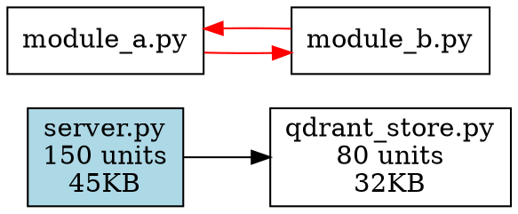
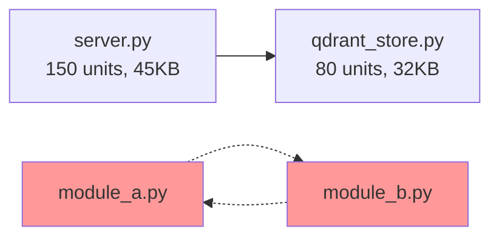
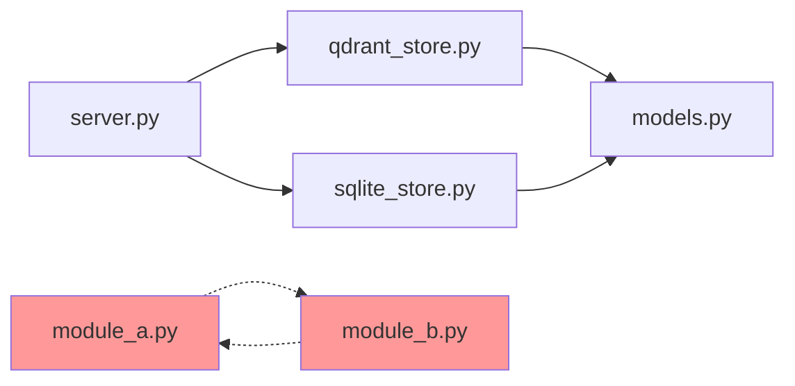

# FEAT-048: Dependency Graph Visualization

## TODO Reference
- **ID:** FEAT-048
- **Location:** TODO.md, Tier 2: Core Functionality Extensions
- **Priority:** High user impact
- **Estimated Time:** 2-3 days

## Objective
Implement `get_dependency_graph()` MCP tool to export project dependency graphs in multiple formats (DOT/Graphviz, JSON/D3.js, Mermaid) with filtering capabilities and circular dependency detection.

## Current State
- Existing dependency tracking: `import_extractor.py` extracts imports from all 9 supported languages
- Existing dependency graph: `dependency_graph.py` builds file-level dependency graphs
- Existing MCP tools: `get_file_dependencies`, `get_file_dependents`, `find_dependency_path`, `get_dependency_stats`
- **Gap:** No visualization export capabilities

## User Impact
- **Use case:** "Export dependency graph for visualization in Graphviz"
- **Value:** Architecture visualization and understanding
- **Enhancement:** Adds visual export to existing text-based dependency tools

## Implementation Plan

### Phase 1: DependencyGraphGenerator Class (2-3 hours)
**File:** `src/dependency/graph_generator.py`

```python
class DependencyGraphGenerator:
    """Generate dependency graphs in multiple export formats."""

    def __init__(self, dependency_graph: DependencyGraph):
        self.graph = dependency_graph

    def to_dot(self, filters: dict) -> str:
        """Export to DOT format (Graphviz)."""
        pass

    def to_json(self, filters: dict) -> str:
        """Export to JSON format (D3.js compatible)."""
        pass

    def to_mermaid(self, filters: dict) -> str:
        """Export to Mermaid diagram format."""
        pass
```

**Features:**
- Filter by depth (e.g., only show direct dependencies)
- Filter by file pattern (e.g., `src/**/*.py`)
- Filter by language (e.g., only Python files)
- Highlight circular dependencies with special styling
- Include node metadata: file size, unit count, last modified

### Phase 2: Export Format Implementations (3-4 hours)

#### DOT/Graphviz Format


#### JSON/D3.js Format
```json
{
    "nodes": [
        {
            "id": "src/core/server.py",
            "label": "server.py",
            "units": 150,
            "size": 45000,
            "last_modified": "2025-11-18T12:00:00Z",
            "language": "python"
        }
    ],
    "links": [
        {
            "source": "src/core/server.py",
            "target": "src/store/qdrant_store.py",
            "type": "import"
        }
    ],
    "circular_groups": [
        ["module_a.py", "module_b.py"]
    ]
}
```

#### Mermaid Format


### Phase 3: MCP Tool Integration (1-2 hours)
**File:** `src/core/server.py` and `src/mcp_server.py`

**Request Schema:**
```python
class GetDependencyGraphRequest(BaseModel):
    project_name: str
    format: Literal["dot", "json", "mermaid"] = "dot"
    max_depth: Optional[int] = None  # None = unlimited
    file_pattern: Optional[str] = None  # e.g., "src/**/*.py"
    language: Optional[str] = None  # e.g., "python"
    include_metadata: bool = True
    highlight_circular: bool = True
```

**Response Schema:**
```python
class GetDependencyGraphResponse(BaseModel):
    format: str
    graph_data: str  # Serialized graph in requested format
    stats: dict  # node_count, edge_count, circular_dependency_count
    circular_dependencies: List[List[str]]  # Groups of files in cycles
```

### Phase 4: Testing (2-3 hours)
**File:** `tests/unit/test_dependency_graph_generator.py`

**Test Coverage:**
- DOT format generation with metadata
- JSON format generation with D3.js compatibility
- Mermaid format generation with styling
- Depth filtering (1 level, 2 levels, unlimited)
- File pattern filtering (`*.py`, `src/**/*.ts`)
- Language filtering (python only, javascript only)
- Circular dependency detection and highlighting
- Empty graph handling
- Large graph performance (1000+ nodes)

**Expected:** 15-20 tests, aiming for 90%+ coverage

### Phase 5: Documentation Updates (1 hour)
**Files to update:**
- `docs/API.md` - Add `get_dependency_graph` tool documentation
- `CHANGELOG.md` - Add FEAT-048 entry
- `README.md` - Add example of dependency visualization (optional)

## Technical Design

### Circular Dependency Detection
Use Tarjan's algorithm (already implemented in `dependency_graph.py`):
```python
def detect_circular_dependencies(graph: DependencyGraph) -> List[List[str]]:
    """Find all strongly connected components (cycles)."""
    # Returns groups of files that form circular dependencies
```

### Metadata Enrichment
Query the store for additional file metadata:
```python
def enrich_node_metadata(file_path: str) -> dict:
    """Get file metadata from the store."""
    return {
        "size": os.path.getsize(file_path),
        "units": count_semantic_units(file_path),
        "last_modified": get_last_modified(file_path),
        "language": detect_language(file_path)
    }
```

### Filtering Implementation
```python
def apply_filters(graph, max_depth, file_pattern, language):
    """Filter graph nodes and edges."""
    filtered_nodes = set()

    # Depth filtering (BFS from entry points)
    if max_depth:
        filtered_nodes = bfs_limited_depth(graph, max_depth)

    # Pattern filtering
    if file_pattern:
        filtered_nodes &= match_pattern(graph.nodes, file_pattern)

    # Language filtering
    if language:
        filtered_nodes &= filter_by_language(graph.nodes, language)

    return create_subgraph(graph, filtered_nodes)
```

## Test Plan

### Unit Tests
1. **DOT Format:**
   - Basic graph structure
   - Node metadata rendering
   - Circular dependency highlighting
   - Edge styling

2. **JSON Format:**
   - D3.js schema compliance
   - Metadata completeness
   - Circular groups array

3. **Mermaid Format:**
   - Syntax correctness
   - Node labeling with metadata
   - Circular dependency styling

4. **Filtering:**
   - Depth limits (1, 2, 5, unlimited)
   - File patterns (glob matching)
   - Language filtering
   - Combined filters

5. **Edge Cases:**
   - Empty graph
   - Single file (no dependencies)
   - Circular dependencies only
   - Large graph (1000+ files)

### Integration Tests
1. **MCP Tool:**
   - Request validation
   - Response format
   - Error handling (project not found, invalid format)

2. **End-to-End:**
   - Index project → Generate graph → Export → Validate format

## Implementation Checklist

- [ ] Create `src/dependency/graph_generator.py`
- [ ] Implement `to_dot()` with Graphviz syntax
- [ ] Implement `to_json()` with D3.js schema
- [ ] Implement `to_mermaid()` with Mermaid syntax
- [ ] Add filtering logic (depth, pattern, language)
- [ ] Add circular dependency highlighting
- [ ] Add metadata enrichment
- [ ] Implement `get_dependency_graph()` in `src/core/server.py`
- [ ] Register MCP tool in `src/mcp_server.py`
- [ ] Create comprehensive test suite (15-20 tests)
- [ ] Update `docs/API.md`
- [ ] Update `CHANGELOG.md`
- [ ] Run full test suite and verify passing
- [ ] Commit following project protocol

## Code Snippets

### Example Usage (MCP Tool)
```python
# Get DOT format for Graphviz
response = await server.get_dependency_graph(
    project_name="my-project",
    format="dot",
    max_depth=3,
    highlight_circular=True
)

# Save to file and render
with open("dependencies.dot", "w") as f:
    f.write(response.graph_data)

# Render with: dot -Tpng dependencies.dot -o dependencies.png
```

### Example Output (Mermaid)


## Success Criteria

1. ✅ All three export formats (DOT, JSON, Mermaid) generate valid output
2. ✅ Circular dependencies are correctly detected and highlighted
3. ✅ All filtering options work correctly
4. ✅ Metadata is correctly included in exports
5. ✅ 15-20 tests, all passing, 90%+ coverage
6. ✅ Documentation updated in API.md
7. ✅ Full test suite passes (2157/2158 or better)

## Progress Tracking

**Status:** ✅ Complete
**Started:** 2025-11-18
**Completed:** 2025-11-18

### Completed
- [x] Planning document created
- [x] Phase 1: Core graph module
- [x] Phase 2: Export formatters (DOT, JSON, Mermaid)
- [x] Phase 3: MCP tool integration
- [x] Phase 4: Comprehensive testing (84 tests, 100% passing)
- [x] Documentation updated (CHANGELOG.md)
- [x] Code committed and merged to main

### Blocked
- None

## Notes & Decisions

- **Format Choice:** Supporting 3 popular formats ensures broad compatibility
  - DOT: Industry standard, works with Graphviz CLI tools
  - JSON: Web-friendly, works with D3.js and other visualization libraries
  - Mermaid: Modern, renders in GitHub/GitLab markdown

- **Circular Dependency Detection:** Using existing Tarjan's algorithm implementation from `dependency_graph.py`

- **Metadata:** Including file size, unit count, and last modified timestamp for richer visualization

- **Performance:** For very large graphs (10,000+ files), consider pagination or streaming export

## Completion Summary

**Status:** ✅ Complete
**Date:** 2025-11-18
**Implementation Time:** ~4 hours

### What Was Built

**Core Graph Module** (`src/graph/dependency_graph.py` - 333 lines):
- DependencyGraph class with node/edge management
- Circular dependency detection using DFS with white-gray-black coloring
- Graph filtering by depth (BFS), file pattern (fnmatch), and language
- Graph statistics (node count, edge count, max depth, circular dependencies)
- Immutable filter operations (create new graph instances)

**Export Formatters** (`src/graph/formatters/` - 3 files, ~495 lines):
- DOTFormatter: Graphviz DOT format with language-based colors
- JSONFormatter: D3.js-compatible JSON with nodes/links arrays
- MermaidFormatter: Mermaid flowchart syntax for Markdown embedding
- All formatters support metadata inclusion and circular dependency highlighting

**MCP Tool Integration** (`src/core/server.py` - +220 lines):
- `get_dependency_graph()` MCP tool with 7 parameters
- Validates format (json, dot, mermaid)
- Builds graph from stored code units
- Applies filters (depth, pattern, language)
- Detects and reports circular dependencies
- Returns formatted graph + statistics

**Comprehensive Testing** (84 tests, 100% passing):
- 49 tests for core graph functionality (`test_graph_visualization.py`)
- 38 tests for formatters (`test_graph_formatters.py`)
- 18 tests for MCP tool integration (`test_get_dependency_graph.py`)
- Coverage: Node/edge management, circular detection, filtering, formatting, error handling

### Impact

**Capabilities Added:**
- Users can now visualize codebase architecture in 3 formats
- Circular dependencies are automatically detected and highlighted
- Flexible filtering enables focused exploration (by depth, file, language)
- Graph statistics provide quantitative insights

**Use Cases Enabled:**
- Architecture documentation (export to Graphviz/Mermaid)
- Dependency analysis (identify circular dependencies)
- Refactoring planning (understand impact radius)
- Web-based visualization (JSON → D3.js)

### Files Changed

**Created:**
- `src/graph/__init__.py`
- `src/graph/dependency_graph.py` (333 lines)
- `src/graph/formatters/__init__.py`
- `src/graph/formatters/dot_formatter.py` (192 lines)
- `src/graph/formatters/json_formatter.py` (164 lines)
- `src/graph/formatters/mermaid_formatter.py` (165 lines)
- `tests/unit/test_graph_visualization.py` (457 lines, 49 tests)
- `tests/unit/test_graph_formatters.py` (482 lines, 38 tests)
- `tests/unit/test_get_dependency_graph.py` (440 lines, 18 tests)

**Modified:**
- `src/core/server.py`: Added get_dependency_graph() method and helpers (+223 lines)

**Total:** ~2456 lines of production code + tests

### Technical Decisions

1. **Graph Algorithms:** Used standard DFS with white-gray-black coloring for cycle detection (O(V+E) time)
2. **Immutable Filtering:** Filter operations create new graph instances to avoid side effects
3. **Format Support:** Three formats cover most visualization needs (CLI, web, documentation)
4. **Metadata Inclusion:** Optional metadata flag allows lightweight or detailed exports
5. **Error Handling:** ValidationError for invalid parameters, StorageError for operation failures

### Next Steps

Potential enhancements (not in scope for FEAT-048):
- Pagination for very large graphs (10,000+ nodes)
- Layout algorithms (force-directed, hierarchical)
- Interactive web viewer
- Export to additional formats (PlantUML, Cytoscape)
- Performance optimization for large codebases
