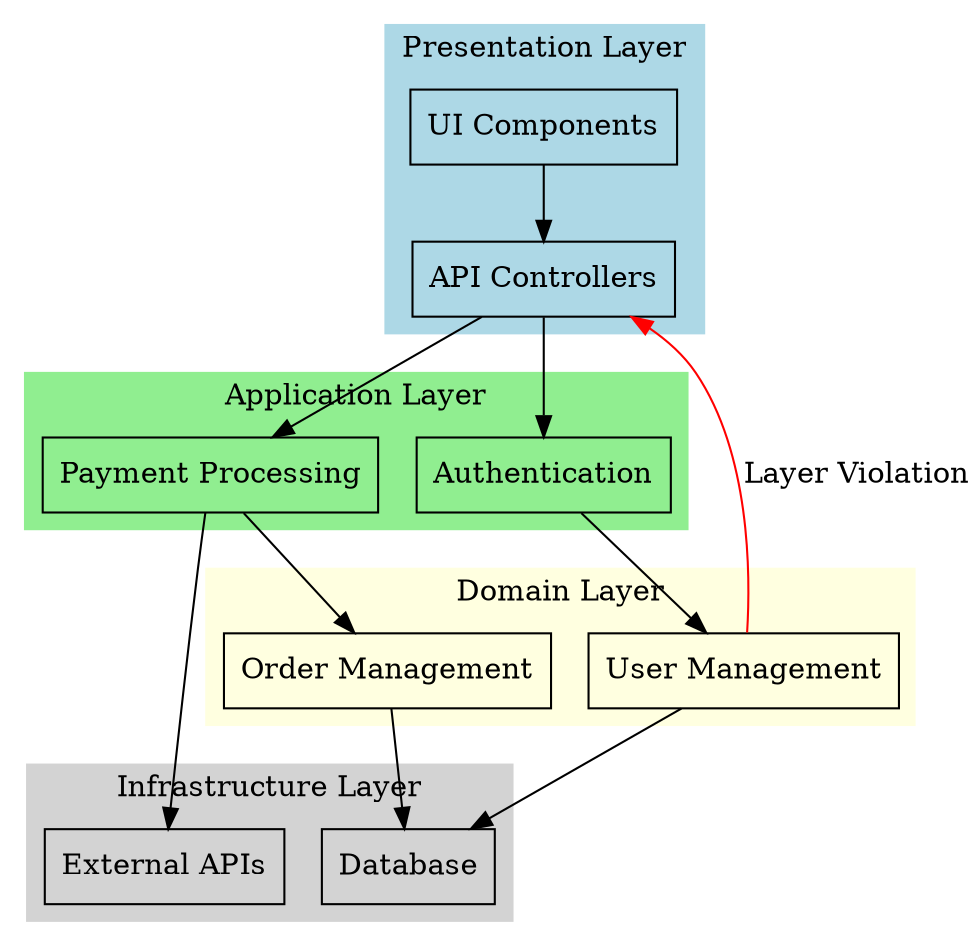
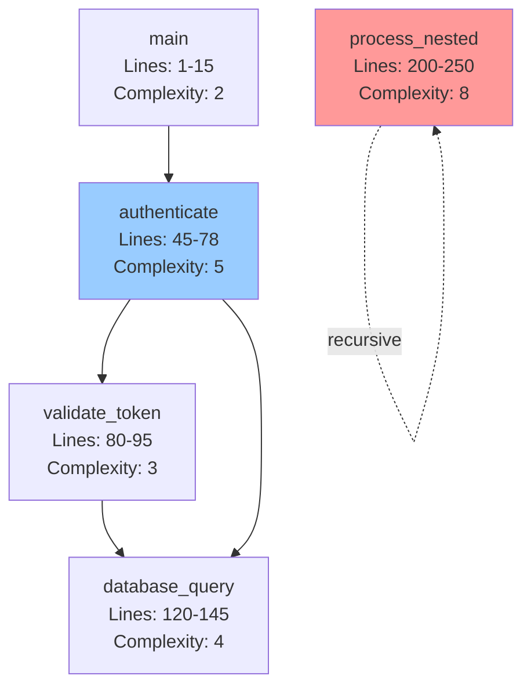

# FEAT-062: Architecture Visualization & Diagrams - Implementation Plan

## TODO Reference
- **ID:** FEAT-062
- **Location:** TODO.md, Tier 2: Core Functionality Extensions → Phase 3: Visualization
- **Priority:** 🔥 High-impact core functionality
- **Estimated Time:** 4-6 weeks
- **Complexity:** Very High - Requires graph theory, layout algorithms, call graph analysis, and web visualization

## Objective

Transform architecture discovery from **mental modeling to visual understanding** by adding three comprehensive visualization capabilities:

1. **`visualize_architecture(project)`** - Generate high-level architecture diagram (components, layers, boundaries)
2. **`visualize_dependencies(file_or_module)`** - Interactive dependency graph with depth control
3. **`visualize_call_graph(function_name)`** - Call graph showing function relationships

### Impact
- **10x faster architecture understanding** - Visual diagrams vs reading code
- **Shareable documentation** - Export to PNG/SVG/PDF for design docs
- **Pattern detection** - Automatically highlight circular dependencies, tight coupling, deep nesting
- **Onboarding acceleration** - New developers understand structure in minutes, not days

## Current Limitations

### What Can't Be Done Today

1. **No architecture-level visualization** - Can see individual dependencies but not overall structure
2. **No layered component view** - Can't distinguish presentation/business/data layers
3. **No interactive exploration** - Static text output, no zoom/pan/filter
4. **No image generation** - Only text formats (DOT/JSON/Mermaid), no rendered images
5. **No call graph visualization** - FEAT-048 shows file dependencies, not function call relationships
6. **No pattern highlighting** - Circular deps detected but not visually emphasized

### Current Capabilities (Foundation to Build On)

- ✅ **FEAT-048**: Dependency graph with DOT/JSON/Mermaid export (file-level)
- ✅ Import extraction across 17 file formats
- ✅ Circular dependency detection (Tarjan's algorithm)
- ✅ Graph filtering (depth, pattern, language)
- ✅ Semantic code indexing (functions, classes, methods)
- ✅ Tree-sitter parsing for call extraction

### The Gap

**Existing tools (FEAT-048) provide FILE-LEVEL dependency graphs.**
**FEAT-062 adds ARCHITECTURE diagrams, INTERACTIVE visualization, and FUNCTION CALL GRAPHS.**

## Technical Design

### Architecture Overview

```
┌─────────────────────────────────────────────────────────────┐
│                    MCP Tools (User-facing)                   │
├─────────────────────────────────────────────────────────────┤
│  visualize_architecture()  │  visualize_dependencies()      │
│  visualize_call_graph()                                      │
└─────────────────────────────────────────────────────────────┘
                              │
                              ▼
┌─────────────────────────────────────────────────────────────┐
│                   Visualization Engine                       │
├─────────────────────────────────────────────────────────────┤
│  • ArchitectureAnalyzer    │  • ComponentDetector           │
│  • CallGraphBuilder        │  • LayoutEngine                │
│  • ImageRenderer           │  • PatternDetector             │
└─────────────────────────────────────────────────────────────┘
                              │
                              ▼
┌─────────────────────────────────────────────────────────────┐
│                    Export Formatters                         │
├─────────────────────────────────────────────────────────────┤
│  • DOT/Graphviz (existing) │  • Mermaid (existing)          │
│  • D3.js JSON (existing)   │  • PNG/SVG/PDF (new)           │
│  • PlantUML (new)          │  • Interactive HTML (new)      │
└─────────────────────────────────────────────────────────────┘
                              │
                              ▼
┌─────────────────────────────────────────────────────────────┐
│              Underlying Data Structures                      │
├─────────────────────────────────────────────────────────────┤
│  • DependencyGraph (FEAT-048)                                │
│  • CallGraph (FEAT-059 - to be built)                        │
│  • ComponentGraph (new)                                      │
└─────────────────────────────────────────────────────────────┘
```

### Core Data Structures

#### 1. Component Graph (Architecture-level)

```python
# src/visualization/architecture_graph.py

from dataclasses import dataclass, field
from typing import List, Dict, Set, Optional
from enum import Enum

class ComponentType(str, Enum):
    """Type of architectural component."""
    PRESENTATION = "presentation"      # UI/Frontend
    API = "api"                        # REST/GraphQL endpoints
    BUSINESS_LOGIC = "business_logic"  # Core domain logic
    DATA_ACCESS = "data_access"        # Database/storage
    INTEGRATION = "integration"        # External services
    UTILITY = "utility"                # Helpers/tools
    CONFIG = "config"                  # Configuration
    TEST = "test"                      # Test code

class LayerType(str, Enum):
    """Architectural layers."""
    PRESENTATION = "presentation"
    APPLICATION = "application"
    DOMAIN = "domain"
    INFRASTRUCTURE = "infrastructure"
    CROSS_CUTTING = "cross_cutting"

@dataclass
class Component:
    """
    Architectural component (group of related files).

    A component represents a cohesive set of files that work together
    for a specific purpose (e.g., "Authentication", "User Management").
    """
    name: str                          # Component name (e.g., "Authentication")
    component_type: ComponentType      # Type classification
    layer: LayerType                   # Architectural layer
    files: List[str] = field(default_factory=list)  # File paths
    entry_points: List[str] = field(default_factory=list)  # Public interfaces
    file_count: int = 0
    total_lines: int = 0
    complexity_score: float = 0.0      # Average cyclomatic complexity
    responsibilities: List[str] = field(default_factory=list)  # What it does

@dataclass
class ComponentEdge:
    """Dependency between components."""
    source: str                        # Component name
    target: str                        # Component name
    dependency_count: int = 0          # Number of files depending
    coupling_strength: float = 0.0     # 0.0-1.0 strength metric
    is_cross_layer: bool = False       # Violates layer separation?

@dataclass
class Boundary:
    """Architectural boundary (e.g., module, package)."""
    name: str                          # Boundary name
    components: List[str] = field(default_factory=list)  # Components inside
    boundary_type: str = "module"      # module, package, service

class ComponentGraph:
    """
    High-level architecture graph.

    Groups files into components and shows component relationships.
    """

    def __init__(self):
        self.components: Dict[str, Component] = {}
        self.edges: List[ComponentEdge] = []
        self.boundaries: List[Boundary] = []
        self.patterns: List[str] = []  # Detected patterns

    def add_component(self, component: Component) -> None:
        """Add architectural component."""
        self.components[component.name] = component

    def add_edge(self, edge: ComponentEdge) -> None:
        """Add component dependency."""
        self.edges.append(edge)

    def add_boundary(self, boundary: Boundary) -> None:
        """Add architectural boundary."""
        self.boundaries.append(boundary)

    def detect_layers(self) -> Dict[LayerType, List[str]]:
        """Group components by architectural layer."""
        layers = {}
        for comp in self.components.values():
            if comp.layer not in layers:
                layers[comp.layer] = []
            layers[comp.layer].append(comp.name)
        return layers

    def find_violations(self) -> List[str]:
        """
        Find architectural violations.

        Returns:
            List of violation descriptions
        """
        violations = []

        # Check for layer violations (lower layers shouldn't depend on higher)
        layer_order = [
            LayerType.INFRASTRUCTURE,
            LayerType.DOMAIN,
            LayerType.APPLICATION,
            LayerType.PRESENTATION,
        ]

        for edge in self.edges:
            if edge.is_cross_layer:
                source = self.components.get(edge.source)
                target = self.components.get(edge.target)
                if source and target:
                    violations.append(
                        f"{source.layer.value} → {target.layer.value}: "
                        f"{edge.source} depends on {edge.target}"
                    )

        return violations
```

#### 2. Call Graph Extension (Function-level)

```python
# src/visualization/call_graph.py
# Extends FEAT-059 with visualization-specific features

from dataclasses import dataclass
from typing import List, Dict, Set, Optional

@dataclass
class CallGraphNode:
    """Function node in call graph."""
    function_name: str
    qualified_name: str  # Module.Class.method
    file_path: str
    language: str
    start_line: int
    end_line: int
    cyclomatic_complexity: int = 1
    is_entry_point: bool = False  # main(), API handler, etc.
    is_recursive: bool = False
    call_depth: int = 0  # Distance from entry point

@dataclass
class CallGraphEdge:
    """Function call relationship."""
    caller: str  # Qualified name
    callee: str  # Qualified name
    call_count: int = 1  # How many times called
    call_sites: List[int] = field(default_factory=list)  # Line numbers

class CallGraph:
    """
    Function call graph for visualization.

    Shows which functions call which other functions.
    """

    def __init__(self):
        self.nodes: Dict[str, CallGraphNode] = {}
        self.edges: List[CallGraphEdge] = []
        self._adjacency: Dict[str, Set[str]] = {}  # caller -> callees
        self._reverse: Dict[str, Set[str]] = {}     # callee -> callers

    def add_call(self, caller: str, callee: str, line: int) -> None:
        """Record a function call."""
        if caller not in self._adjacency:
            self._adjacency[caller] = set()
        if callee not in self._reverse:
            self._reverse[callee] = set()

        self._adjacency[caller].add(callee)
        self._reverse[callee].add(caller)

        # Add/update edge
        edge = self._find_edge(caller, callee)
        if edge:
            edge.call_count += 1
            edge.call_sites.append(line)
        else:
            self.edges.append(CallGraphEdge(
                caller=caller,
                callee=callee,
                call_sites=[line]
            ))

    def get_subgraph(
        self,
        root_function: str,
        max_depth: int = 3,
        direction: str = "both"  # "callers", "callees", "both"
    ) -> "CallGraph":
        """
        Extract subgraph around a function.

        Args:
            root_function: Function to center on
            max_depth: Maximum traversal depth
            direction: Which edges to follow

        Returns:
            New CallGraph with filtered nodes/edges
        """
        subgraph = CallGraph()
        visited = set()

        def traverse(func: str, depth: int, direction: str):
            if depth > max_depth or func in visited:
                return
            visited.add(func)

            if func in self.nodes:
                subgraph.nodes[func] = self.nodes[func]

            if direction in ["callees", "both"]:
                for callee in self._adjacency.get(func, []):
                    edge = self._find_edge(func, callee)
                    if edge:
                        subgraph.edges.append(edge)
                    traverse(callee, depth + 1, "callees")

            if direction in ["callers", "both"]:
                for caller in self._reverse.get(func, []):
                    edge = self._find_edge(caller, func)
                    if edge:
                        subgraph.edges.append(edge)
                    traverse(caller, depth + 1, "callers")

        traverse(root_function, 0, direction)
        return subgraph

    def detect_recursive_functions(self) -> List[str]:
        """Find functions that call themselves (directly or indirectly)."""
        recursive = []

        for func in self.nodes.keys():
            if self._is_reachable(func, func):
                recursive.append(func)
                self.nodes[func].is_recursive = True

        return recursive

    def _is_reachable(self, source: str, target: str) -> bool:
        """Check if target is reachable from source via BFS."""
        if source == target:
            return False  # Don't count direct self-reference

        visited = set()
        queue = [source]

        while queue:
            current = queue.pop(0)
            if current == target:
                return True

            if current in visited:
                continue
            visited.add(current)

            for neighbor in self._adjacency.get(current, []):
                if neighbor not in visited:
                    queue.append(neighbor)

        return False

    def _find_edge(self, caller: str, callee: str) -> Optional[CallGraphEdge]:
        """Find existing edge."""
        for edge in self.edges:
            if edge.caller == caller and edge.callee == callee:
                return edge
        return None
```

### 3. Component Detection Algorithm

```python
# src/visualization/component_detector.py

from pathlib import Path
from typing import List, Dict, Set
import fnmatch

class ComponentDetector:
    """
    Detect architectural components from file structure and imports.

    Strategy:
    1. Directory-based grouping (src/auth/, src/payments/)
    2. File naming patterns (*_controller.py, *_service.py)
    3. Import clustering (files that import each other frequently)
    4. Entry point analysis (main.py, app.py, __init__.py)
    """

    def __init__(self, dependency_graph: DependencyGraph):
        self.dep_graph = dependency_graph
        self.components: Dict[str, Component] = {}

    def detect_components(
        self,
        project_root: Path,
        grouping_strategy: str = "directory"  # "directory", "naming", "clustering"
    ) -> ComponentGraph:
        """
        Detect components in codebase.

        Args:
            project_root: Project root directory
            grouping_strategy: How to group files into components

        Returns:
            ComponentGraph with detected components
        """
        if grouping_strategy == "directory":
            return self._detect_by_directory(project_root)
        elif grouping_strategy == "naming":
            return self._detect_by_naming_patterns()
        elif grouping_strategy == "clustering":
            return self._detect_by_import_clustering()
        else:
            raise ValueError(f"Unknown strategy: {grouping_strategy}")

    def _detect_by_directory(self, project_root: Path) -> ComponentGraph:
        """
        Group files by directory structure.

        Example:
            src/auth/         → "Authentication" component
            src/payments/     → "Payments" component
            src/users/        → "User Management" component
        """
        comp_graph = ComponentGraph()
        dir_groups: Dict[str, List[str]] = {}

        # Group files by parent directory
        for file_path in self.dep_graph.nodes.keys():
            path = Path(file_path)
            relative = path.relative_to(project_root) if project_root else path

            # Get first meaningful directory (skip src/)
            parts = relative.parts
            if len(parts) > 1 and parts[0] in ["src", "lib"]:
                component_name = parts[1]
            elif len(parts) > 0:
                component_name = parts[0]
            else:
                component_name = "root"

            if component_name not in dir_groups:
                dir_groups[component_name] = []
            dir_groups[component_name].append(file_path)

        # Create components
        for comp_name, files in dir_groups.items():
            comp_type = self._classify_component_type(comp_name, files)
            layer = self._classify_layer(comp_type, files)

            component = Component(
                name=comp_name.replace("_", " ").title(),
                component_type=comp_type,
                layer=layer,
                files=files,
                file_count=len(files)
            )

            # Detect entry points
            for f in files:
                if self._is_entry_point(f):
                    component.entry_points.append(f)

            comp_graph.add_component(component)

        # Add edges between components
        self._build_component_edges(comp_graph, dir_groups)

        return comp_graph

    def _classify_component_type(
        self,
        name: str,
        files: List[str]
    ) -> ComponentType:
        """Classify component type based on name and files."""
        name_lower = name.lower()

        # UI/Frontend patterns
        if any(x in name_lower for x in ["ui", "view", "component", "page", "frontend"]):
            return ComponentType.PRESENTATION

        # API patterns
        if any(x in name_lower for x in ["api", "route", "endpoint", "controller"]):
            return ComponentType.API

        # Data access patterns
        if any(x in name_lower for x in ["model", "repository", "dao", "database", "db"]):
            return ComponentType.DATA_ACCESS

        # Integration patterns
        if any(x in name_lower for x in ["integration", "client", "adapter", "external"]):
            return ComponentType.INTEGRATION

        # Utility patterns
        if any(x in name_lower for x in ["util", "helper", "common", "shared"]):
            return ComponentType.UTILITY

        # Config patterns
        if any(x in name_lower for x in ["config", "settings", "env"]):
            return ComponentType.CONFIG

        # Test patterns
        if any(x in name_lower for x in ["test", "spec", "__test__"]):
            return ComponentType.TEST

        # Default to business logic
        return ComponentType.BUSINESS_LOGIC

    def _classify_layer(
        self,
        comp_type: ComponentType,
        files: List[str]
    ) -> LayerType:
        """Map component type to architectural layer."""
        mapping = {
            ComponentType.PRESENTATION: LayerType.PRESENTATION,
            ComponentType.API: LayerType.APPLICATION,
            ComponentType.BUSINESS_LOGIC: LayerType.DOMAIN,
            ComponentType.DATA_ACCESS: LayerType.INFRASTRUCTURE,
            ComponentType.INTEGRATION: LayerType.INFRASTRUCTURE,
            ComponentType.UTILITY: LayerType.CROSS_CUTTING,
            ComponentType.CONFIG: LayerType.CROSS_CUTTING,
            ComponentType.TEST: LayerType.CROSS_CUTTING,
        }
        return mapping.get(comp_type, LayerType.DOMAIN)

    def _is_entry_point(self, file_path: str) -> bool:
        """Check if file is an entry point."""
        filename = Path(file_path).name.lower()
        return filename in [
            "main.py", "app.py", "__init__.py", "server.py",
            "index.js", "index.ts", "main.js", "main.ts",
            "application.java", "main.java"
        ]

    def _build_component_edges(
        self,
        comp_graph: ComponentGraph,
        dir_groups: Dict[str, List[str]]
    ) -> None:
        """Build edges between components based on file dependencies."""
        # Map files to components
        file_to_comp: Dict[str, str] = {}
        for comp_name, files in dir_groups.items():
            for f in files:
                file_to_comp[f] = comp_name

        # Count dependencies between components
        comp_deps: Dict[tuple, int] = {}  # (source_comp, target_comp) -> count

        for edge in self.dep_graph.edges:
            source_comp = file_to_comp.get(edge.source)
            target_comp = file_to_comp.get(edge.target)

            if source_comp and target_comp and source_comp != target_comp:
                key = (source_comp, target_comp)
                comp_deps[key] = comp_deps.get(key, 0) + 1

        # Create component edges
        for (source_comp, target_comp), count in comp_deps.items():
            source = comp_graph.components[source_comp.replace("_", " ").title()]
            target = comp_graph.components[target_comp.replace("_", " ").title()]

            # Calculate coupling strength
            coupling = count / max(source.file_count, 1)

            # Check if cross-layer
            is_cross = self._is_cross_layer_dependency(source.layer, target.layer)

            comp_graph.add_edge(ComponentEdge(
                source=source.name,
                target=target.name,
                dependency_count=count,
                coupling_strength=coupling,
                is_cross_layer=is_cross
            ))

    def _is_cross_layer_dependency(
        self,
        source_layer: LayerType,
        target_layer: LayerType
    ) -> bool:
        """Check if dependency violates layer ordering."""
        layer_order = {
            LayerType.INFRASTRUCTURE: 0,
            LayerType.DOMAIN: 1,
            LayerType.APPLICATION: 2,
            LayerType.PRESENTATION: 3,
            LayerType.CROSS_CUTTING: -1,  # Can be used by any layer
        }

        source_order = layer_order.get(source_layer, 0)
        target_order = layer_order.get(target_layer, 0)

        # Cross-cutting can be used by anyone
        if target_order == -1:
            return False

        # Lower layers shouldn't depend on higher layers
        return source_order < target_order
```

### 4. Image Rendering with Graphviz

```python
# src/visualization/image_renderer.py

import subprocess
import tempfile
from pathlib import Path
from typing import Literal

ImageFormat = Literal["png", "svg", "pdf"]

class ImageRenderer:
    """
    Render graphs as images using Graphviz.

    Requires: Graphviz installed (https://graphviz.org/download/)
    """

    def __init__(self):
        self._check_graphviz_installed()

    def _check_graphviz_installed(self) -> bool:
        """Check if Graphviz is installed."""
        try:
            result = subprocess.run(
                ["dot", "-V"],
                capture_output=True,
                text=True,
                timeout=5
            )
            return result.returncode == 0
        except (subprocess.TimeoutExpired, FileNotFoundError):
            return False

    def render(
        self,
        dot_source: str,
        output_format: ImageFormat = "png",
        layout_engine: str = "dot"  # dot, neato, fdp, circo, twopi
    ) -> bytes:
        """
        Render DOT source to image.

        Args:
            dot_source: Graphviz DOT format string
            output_format: Image format (png, svg, pdf)
            layout_engine: Graphviz layout algorithm

        Returns:
            Image data as bytes

        Raises:
            RuntimeError: If Graphviz not installed or rendering fails
        """
        if not self._check_graphviz_installed():
            raise RuntimeError(
                "Graphviz not installed. Install from https://graphviz.org/download/"
            )

        # Create temporary file for DOT source
        with tempfile.NamedTemporaryFile(
            mode='w',
            suffix='.dot',
            delete=False
        ) as f:
            f.write(dot_source)
            dot_file = f.name

        try:
            # Run Graphviz
            result = subprocess.run(
                [layout_engine, f"-T{output_format}", dot_file],
                capture_output=True,
                timeout=30
            )

            if result.returncode != 0:
                raise RuntimeError(
                    f"Graphviz rendering failed: {result.stderr.decode()}"
                )

            return result.stdout

        finally:
            # Clean up temp file
            Path(dot_file).unlink(missing_ok=True)
```

### 5. Interactive Web Viewer

```python
# src/visualization/web_viewer.py

import json
from pathlib import Path
from typing import Dict, Any

class InteractiveWebViewer:
    """
    Generate interactive HTML viewer for graphs.

    Uses D3.js force-directed layout with zoom, pan, and filtering.
    """

    HTML_TEMPLATE = '''
<!DOCTYPE html>
<html>
<head>
    <meta charset="utf-8">
    <title>{title}</title>
    <script src="https://d3js.org/d3.v7.min.js"></script>
    <style>
        body {{
            margin: 0;
            font-family: Arial, sans-serif;
            overflow: hidden;
        }}

        #graph {{
            width: 100vw;
            height: 100vh;
        }}

        .controls {{
            position: fixed;
            top: 10px;
            left: 10px;
            background: white;
            padding: 15px;
            border-radius: 5px;
            box-shadow: 0 2px 10px rgba(0,0,0,0.1);
            z-index: 1000;
        }}

        .controls label {{
            display: block;
            margin: 10px 0 5px 0;
        }}

        .node {{
            cursor: pointer;
        }}

        .node circle {{
            stroke: #fff;
            stroke-width: 2px;
        }}

        .node text {{
            font-size: 12px;
            pointer-events: none;
        }}

        .link {{
            stroke: #999;
            stroke-opacity: 0.6;
        }}

        .link.circular {{
            stroke: #ff0000;
            stroke-width: 2px;
        }}

        .tooltip {{
            position: absolute;
            background: rgba(0, 0, 0, 0.8);
            color: white;
            padding: 8px;
            border-radius: 4px;
            font-size: 12px;
            pointer-events: none;
            display: none;
        }}
    </style>
</head>
<body>
    <div class="controls">
        <h3>{title}</h3>
        <label>
            <input type="range" id="zoom" min="0.1" max="3" step="0.1" value="1">
            Zoom
        </label>
        <label>
            <input type="text" id="search" placeholder="Search nodes...">
        </label>
        <label>
            <input type="checkbox" id="show-circular" checked>
            Highlight Circular Dependencies
        </label>
        <div id="stats"></div>
    </div>

    <svg id="graph"></svg>
    <div class="tooltip" id="tooltip"></div>

    <script>
        const data = {graph_data_json};

        const width = window.innerWidth;
        const height = window.innerHeight;

        const svg = d3.select("#graph")
            .attr("viewBox", [0, 0, width, height]);

        // Zoom behavior
        const zoom = d3.zoom()
            .scaleExtent([0.1, 3])
            .on("zoom", (event) => {{
                container.attr("transform", event.transform);
            }});

        svg.call(zoom);

        const container = svg.append("g");

        // Force simulation
        const simulation = d3.forceSimulation(data.nodes)
            .force("link", d3.forceLink(data.links).id(d => d.id).distance(100))
            .force("charge", d3.forceManyBody().strength(-300))
            .force("center", d3.forceCenter(width / 2, height / 2));

        // Links
        const link = container.append("g")
            .selectAll("line")
            .data(data.links)
            .join("line")
            .attr("class", d => d.circular ? "link circular" : "link")
            .attr("stroke-width", d => Math.sqrt(d.count || 1));

        // Nodes
        const node = container.append("g")
            .selectAll("g")
            .data(data.nodes)
            .join("g")
            .attr("class", "node")
            .call(d3.drag()
                .on("start", dragstarted)
                .on("drag", dragged)
                .on("end", dragended));

        node.append("circle")
            .attr("r", d => Math.sqrt(d.size || 1000) / 10)
            .attr("fill", d => d.color || "#69b3a2");

        node.append("text")
            .text(d => d.label)
            .attr("x", 12)
            .attr("y", 4);

        // Tooltip
        node.on("mouseover", function(event, d) {{
            d3.select("#tooltip")
                .style("display", "block")
                .style("left", (event.pageX + 10) + "px")
                .style("top", (event.pageY + 10) + "px")
                .html(`
                    <strong>${{d.label}}</strong><br>
                    Files: ${{d.file_count || 1}}<br>
                    Lines: ${{d.total_lines || "N/A"}}<br>
                    Complexity: ${{d.complexity || "N/A"}}
                `);
        }}).on("mouseout", function() {{
            d3.select("#tooltip").style("display", "none");
        }});

        // Simulation tick
        simulation.on("tick", () => {{
            link
                .attr("x1", d => d.source.x)
                .attr("y1", d => d.source.y)
                .attr("x2", d => d.target.x)
                .attr("y2", d => d.target.y);

            node.attr("transform", d => `translate(${{d.x}},${{d.y}})`);
        }});

        // Drag functions
        function dragstarted(event) {{
            if (!event.active) simulation.alphaTarget(0.3).restart();
            event.subject.fx = event.subject.x;
            event.subject.fy = event.subject.y;
        }}

        function dragged(event) {{
            event.subject.fx = event.x;
            event.subject.fy = event.y;
        }}

        function dragended(event) {{
            if (!event.active) simulation.alphaTarget(0);
            event.subject.fx = null;
            event.subject.fy = null;
        }}

        // Controls
        d3.select("#zoom").on("input", function() {{
            const scale = +this.value;
            svg.transition().call(zoom.scaleTo, scale);
        }});

        d3.select("#search").on("input", function() {{
            const query = this.value.toLowerCase();
            node.style("opacity", d =>
                d.label.toLowerCase().includes(query) ? 1 : 0.2
            );
        }});

        d3.select("#show-circular").on("change", function() {{
            link.style("display", d =>
                this.checked || !d.circular ? "block" : "none"
            );
        }});

        // Stats
        d3.select("#stats").html(`
            <p><strong>Statistics:</strong></p>
            <p>Nodes: ${{data.nodes.length}}</p>
            <p>Edges: ${{data.links.length}}</p>
            <p>Circular: ${{data.circular_groups ? data.circular_groups.length : 0}}</p>
        `);
    </script>
</body>
</html>
'''

    def generate(
        self,
        graph_data: Dict[str, Any],
        title: str = "Architecture Visualization"
    ) -> str:
        """
        Generate interactive HTML viewer.

        Args:
            graph_data: D3.js-compatible JSON graph data
            title: Page title

        Returns:
            HTML string
        """
        return self.HTML_TEMPLATE.format(
            title=title,
            graph_data_json=json.dumps(graph_data)
        )
```

### 6. Pattern Detection

```python
# src/visualization/pattern_detector.py

from typing import List, Dict
from dataclasses import dataclass

@dataclass
class ArchitecturePattern:
    """Detected architecture pattern or anti-pattern."""
    name: str
    description: str
    severity: str  # "info", "warning", "error"
    affected_components: List[str]
    recommendation: str

class PatternDetector:
    """
    Detect architectural patterns and anti-patterns.

    Patterns:
    - Circular dependencies
    - Tight coupling (high coupling strength)
    - God components (too many files/responsibilities)
    - Layer violations
    - Dead code (no incoming edges)
    - Hub components (too many dependencies)
    """

    def detect_patterns(
        self,
        comp_graph: ComponentGraph
    ) -> List[ArchitecturePattern]:
        """Detect all patterns."""
        patterns = []

        patterns.extend(self._detect_circular_dependencies(comp_graph))
        patterns.extend(self._detect_tight_coupling(comp_graph))
        patterns.extend(self._detect_god_components(comp_graph))
        patterns.extend(self._detect_layer_violations(comp_graph))
        patterns.extend(self._detect_dead_code(comp_graph))
        patterns.extend(self._detect_hub_components(comp_graph))

        return patterns

    def _detect_circular_dependencies(
        self,
        comp_graph: ComponentGraph
    ) -> List[ArchitecturePattern]:
        """Find circular component dependencies."""
        patterns = []

        # Convert to simple graph for cycle detection
        graph = {}
        for comp in comp_graph.components.values():
            graph[comp.name] = []

        for edge in comp_graph.edges:
            graph[edge.source].append(edge.target)

        # Find cycles using DFS
        cycles = self._find_cycles(graph)

        for cycle in cycles:
            patterns.append(ArchitecturePattern(
                name="Circular Dependency",
                description=f"Components form a circular dependency: {' → '.join(cycle)}",
                severity="error",
                affected_components=cycle,
                recommendation="Refactor to break cycle using dependency inversion"
            ))

        return patterns

    def _detect_tight_coupling(
        self,
        comp_graph: ComponentGraph
    ) -> List[ArchitecturePattern]:
        """Find tightly coupled components."""
        patterns = []

        for edge in comp_graph.edges:
            if edge.coupling_strength > 0.7:  # High coupling threshold
                patterns.append(ArchitecturePattern(
                    name="Tight Coupling",
                    description=f"{edge.source} is tightly coupled to {edge.target} ({edge.coupling_strength:.0%})",
                    severity="warning",
                    affected_components=[edge.source, edge.target],
                    recommendation="Reduce dependencies or introduce an abstraction layer"
                ))

        return patterns

    def _detect_god_components(
        self,
        comp_graph: ComponentGraph
    ) -> List[ArchitecturePattern]:
        """Find components with too many responsibilities."""
        patterns = []

        for comp in comp_graph.components.values():
            if comp.file_count > 50:  # Threshold for "god component"
                patterns.append(ArchitecturePattern(
                    name="God Component",
                    description=f"{comp.name} has {comp.file_count} files (too many responsibilities)",
                    severity="warning",
                    affected_components=[comp.name],
                    recommendation="Split into smaller, focused components"
                ))

        return patterns

    def _detect_layer_violations(
        self,
        comp_graph: ComponentGraph
    ) -> List[ArchitecturePattern]:
        """Find components violating layer architecture."""
        patterns = []

        for edge in comp_graph.edges:
            if edge.is_cross_layer:
                source = comp_graph.components[edge.source]
                target = comp_graph.components[edge.target]

                patterns.append(ArchitecturePattern(
                    name="Layer Violation",
                    description=f"{source.layer.value} → {target.layer.value}: {edge.source} depends on {edge.target}",
                    severity="error",
                    affected_components=[edge.source, edge.target],
                    recommendation="Follow layered architecture: lower layers should not depend on higher layers"
                ))

        return patterns

    def _detect_dead_code(
        self,
        comp_graph: ComponentGraph
    ) -> List[ArchitecturePattern]:
        """Find components with no incoming dependencies."""
        patterns = []

        # Components with incoming edges
        has_incoming = set()
        for edge in comp_graph.edges:
            has_incoming.add(edge.target)

        for comp in comp_graph.components.values():
            if comp.name not in has_incoming and not comp.entry_points:
                patterns.append(ArchitecturePattern(
                    name="Potentially Dead Code",
                    description=f"{comp.name} has no incoming dependencies and no entry points",
                    severity="info",
                    affected_components=[comp.name],
                    recommendation="Verify if this component is still needed"
                ))

        return patterns

    def _detect_hub_components(
        self,
        comp_graph: ComponentGraph
    ) -> List[ArchitecturePattern]:
        """Find components with too many dependencies."""
        patterns = []

        # Count outgoing dependencies
        outgoing = {}
        for edge in comp_graph.edges:
            outgoing[edge.source] = outgoing.get(edge.source, 0) + 1

        for comp_name, count in outgoing.items():
            if count > 10:  # Threshold for hub component
                patterns.append(ArchitecturePattern(
                    name="Hub Component",
                    description=f"{comp_name} depends on {count} other components",
                    severity="warning",
                    affected_components=[comp_name],
                    recommendation="Reduce dependencies or split component"
                ))

        return patterns

    def _find_cycles(self, graph: Dict[str, List[str]]) -> List[List[str]]:
        """Find all cycles in directed graph using DFS."""
        cycles = []
        visited = set()
        rec_stack = set()

        def dfs(node: str, path: List[str]):
            visited.add(node)
            rec_stack.add(node)
            path.append(node)

            for neighbor in graph.get(node, []):
                if neighbor not in visited:
                    dfs(neighbor, path.copy())
                elif neighbor in rec_stack:
                    # Found cycle
                    cycle_start = path.index(neighbor)
                    cycle = path[cycle_start:] + [neighbor]
                    cycles.append(cycle)

            rec_stack.remove(node)

        for node in graph:
            if node not in visited:
                dfs(node, [])

        return cycles
```

## Implementation Phases

### Phase 1: Core Infrastructure (Week 1: 5-7 days)

**Goal:** Build foundational data structures and component detection

**Tasks:**
1. Create `src/visualization/` module
2. Implement `architecture_graph.py` (Component, ComponentGraph, LayerType)
3. Implement `call_graph.py` (CallGraphNode, CallGraphEdge, CallGraph)
4. Implement `component_detector.py` (directory-based grouping)
5. Write unit tests for data structures (15-20 tests)

**Deliverables:**
- Component detection working for directory structure
- Call graph data structure ready
- 80%+ test coverage

**Success Criteria:**
- Can detect components from file structure
- Can classify component types and layers
- All tests passing

### Phase 2: Call Graph Extraction (Week 2: 5-7 days)

**Goal:** Extract function calls from parsed code

**Tasks:**
1. Extend tree-sitter parsing to extract function calls
2. Implement call graph builder for Python (uses AST)
3. Implement call graph builder for JavaScript/TypeScript
4. Implement call graph builder for Java
5. Add call graph to indexing pipeline
6. Write integration tests (10-15 tests)

**Deliverables:**
- Call extraction working for 3+ languages
- Call graph populated during indexing
- Integration with incremental indexer

**Success Criteria:**
- Can extract callers/callees for functions
- Call graph stored in Qdrant (new collection)
- Recursive function detection working

### Phase 3: Architecture Visualization MCP Tool (Week 3: 5-7 days)

**Goal:** Implement `visualize_architecture()` MCP tool

**Tasks:**
1. Implement architecture analyzer (groups files → components)
2. Create architecture diagram formatters (DOT, Mermaid, PlantUML)
3. Add pattern detection (violations, god components, etc.)
4. Implement `visualize_architecture()` in server.py
5. Register MCP tool in mcp_server.py
6. Write comprehensive tests (15-20 tests)

**Deliverables:**
- `visualize_architecture(project)` working
- Exports to DOT, Mermaid, PlantUML
- Pattern detection highlighting violations
- Documentation updated

**Success Criteria:**
- Generates layered architecture diagram
- Detects and highlights violations
- All export formats valid

### Phase 4: Dependency & Call Graph Visualization (Week 4: 5-7 days)

**Goal:** Implement `visualize_dependencies()` and `visualize_call_graph()` tools

**Tasks:**
1. Extend FEAT-048 formatters for enhanced metadata
2. Implement call graph formatters (DOT, Mermaid, D3.js JSON)
3. Add depth control and filtering to visualizations
4. Implement `visualize_dependencies()` in server.py
5. Implement `visualize_call_graph()` in server.py
6. Write tests for both tools (20-25 tests)

**Deliverables:**
- `visualize_dependencies(file_or_module, max_depth)` working
- `visualize_call_graph(function_name, max_depth, direction)` working
- Both support DOT, Mermaid, JSON exports

**Success Criteria:**
- Can visualize file dependencies with depth control
- Can visualize function call graphs
- Recursive functions highlighted

### Phase 5: Image Rendering & Interactive Viewer (Week 5-6: 10-12 days)

**Goal:** Add PNG/SVG rendering and interactive HTML viewer

**Tasks:**
1. Implement `image_renderer.py` (Graphviz integration)
2. Add image export to all 3 MCP tools
3. Implement `web_viewer.py` (D3.js-based interactive viewer)
4. Add interactive HTML export option
5. Create example visualizations for documentation
6. Write rendering tests (10-15 tests)
7. Update documentation with examples

**Deliverables:**
- PNG/SVG/PDF export working
- Interactive HTML viewer with zoom/pan
- Tooltip showing node details
- Search and filter controls

**Success Criteria:**
- Images render correctly (requires Graphviz)
- Interactive viewer works in browser
- All controls functional

### Phase 6: Integration, Testing & Documentation (Final week: 5-7 days)

**Goal:** Integration testing, performance tuning, documentation

**Tasks:**
1. End-to-end testing (index → visualize → export)
2. Performance testing (1000+ node graphs)
3. Write user guide with examples
4. Update API.md with all 3 tools
5. Update CHANGELOG.md
6. Create example visualizations for README
7. Code review and refactoring

**Deliverables:**
- Full test suite passing (60-70 tests total)
- Documentation complete
- Example images in docs/
- Performance benchmarks

**Success Criteria:**
- All tests passing (2800+ tests)
- 85%+ coverage for visualization module
- Documentation with examples
- Performance acceptable (<5s for 1000 nodes)

## MCP Tool Specifications

### 1. visualize_architecture()

**Purpose:** Generate high-level architecture diagram showing components, layers, and dependencies

**Request Schema:**
```python
class VisualizeArchitectureRequest(BaseModel):
    project_name: str
    format: Literal["dot", "mermaid", "plantuml", "json", "png", "svg", "pdf", "html"] = "dot"
    grouping_strategy: Literal["directory", "naming", "clustering"] = "directory"
    include_metadata: bool = True
    highlight_violations: bool = True
    show_layers: bool = True
    max_components: Optional[int] = None  # Limit for large projects
```

**Response Schema:**
```python
class VisualizeArchitectureResponse(BaseModel):
    format: str
    visualization_data: Union[str, bytes]  # Text formats or image bytes
    components: List[Dict[str, Any]]       # Component details
    patterns: List[Dict[str, Any]]         # Detected patterns/violations
    stats: Dict[str, Any]                  # node_count, edge_count, etc.
```

**Example Usage:**
```python
# Get architecture diagram as PNG
response = await server.visualize_architecture(
    project_name="my-project",
    format="png",
    highlight_violations=True,
    show_layers=True
)

# Save image
with open("architecture.png", "wb") as f:
    f.write(response.visualization_data)

# Check for violations
for pattern in response.patterns:
    if pattern["severity"] == "error":
        print(f"❌ {pattern['name']}: {pattern['description']}")
```

### 2. visualize_dependencies()

**Purpose:** Generate dependency graph for a specific file or module

**Request Schema:**
```python
class VisualizeDependenciesRequest(BaseModel):
    project_name: str
    file_or_module: str                    # File path or module name
    format: Literal["dot", "mermaid", "json", "png", "svg", "pdf", "html"] = "dot"
    max_depth: Optional[int] = 3           # Depth limit
    direction: Literal["incoming", "outgoing", "both"] = "both"
    file_pattern: Optional[str] = None     # Filter by pattern (e.g., "*.py")
    language: Optional[str] = None         # Filter by language
    include_metadata: bool = True
    highlight_circular: bool = True
```

**Response Schema:**
```python
class VisualizeDependenciesResponse(BaseModel):
    format: str
    visualization_data: Union[str, bytes]
    nodes: List[Dict[str, Any]]            # Node details
    edges: List[Dict[str, Any]]            # Edge details
    circular_dependencies: List[List[str]] # Circular groups
    stats: Dict[str, Any]
```

**Example Usage:**
```python
# Visualize dependencies for auth module
response = await server.visualize_dependencies(
    project_name="my-project",
    file_or_module="src/auth/",
    format="html",
    max_depth=2,
    direction="both",
    highlight_circular=True
)

# Save interactive viewer
with open("auth_dependencies.html", "w") as f:
    f.write(response.visualization_data)
```

### 3. visualize_call_graph()

**Purpose:** Generate call graph for a specific function

**Request Schema:**
```python
class VisualizeCallGraphRequest(BaseModel):
    project_name: str
    function_name: str                     # Function qualified name
    format: Literal["dot", "mermaid", "json", "png", "svg", "pdf", "html"] = "dot"
    max_depth: int = 3                     # Traversal depth
    direction: Literal["callers", "callees", "both"] = "both"
    include_metadata: bool = True
    highlight_recursive: bool = True       # Highlight recursive calls
    show_complexity: bool = True           # Show cyclomatic complexity
```

**Response Schema:**
```python
class VisualizeCallGraphResponse(BaseModel):
    format: str
    visualization_data: Union[str, bytes]
    functions: List[Dict[str, Any]]        # Function details
    calls: List[Dict[str, Any]]            # Call relationships
    recursive_functions: List[str]         # Recursive function names
    stats: Dict[str, Any]
```

**Example Usage:**
```python
# Visualize call graph for authenticate function
response = await server.visualize_call_graph(
    project_name="my-project",
    function_name="auth.authenticate",
    format="png",
    max_depth=2,
    direction="both",
    highlight_recursive=True
)

# Save image
with open("authenticate_calls.png", "wb") as f:
    f.write(response.visualization_data)

# Check for recursive functions
if response.recursive_functions:
    print(f"Recursive: {', '.join(response.recursive_functions)}")
```

## Export Format Examples

### Architecture Diagram (DOT Format)



### Call Graph (Mermaid Format)



## Test Plan

### Unit Tests (40-45 tests)

#### Component Detection Tests (15 tests)
1. Directory-based grouping
2. Component type classification (API, business logic, data access)
3. Layer classification (presentation, application, domain, infrastructure)
4. Entry point detection
5. Component edge creation
6. Coupling strength calculation
7. Cross-layer dependency detection
8. Empty project handling
9. Single-file project
10. Large project (1000+ files)
11. Naming pattern detection
12. Import clustering
13. Boundary detection
14. Component statistics
15. Filter by component type

#### Call Graph Tests (15 tests)
1. Function call extraction (Python)
2. Method call extraction
3. Recursive function detection
4. Call graph traversal (BFS)
5. Subgraph extraction (callers only)
6. Subgraph extraction (callees only)
7. Subgraph extraction (both directions)
8. Max depth limiting
9. Call site tracking
10. Qualified name resolution
11. Cross-file calls
12. Lambda/anonymous function calls
13. Constructor calls
14. Empty call graph
15. Call graph statistics

#### Pattern Detection Tests (10 tests)
1. Circular dependency detection
2. Tight coupling detection
3. God component detection
4. Layer violation detection
5. Dead code detection
6. Hub component detection
7. Multiple patterns on same component
8. No patterns (clean architecture)
9. Pattern severity levels
10. Pattern recommendations

#### Image Rendering Tests (5 tests)
1. DOT to PNG conversion
2. DOT to SVG conversion
3. DOT to PDF conversion
4. Graphviz not installed error
5. Invalid DOT syntax error

### Integration Tests (20-25 tests)

#### visualize_architecture() Tests (8 tests)
1. Basic architecture visualization (DOT format)
2. Mermaid format export
3. PlantUML format export
4. PNG image generation
5. Interactive HTML viewer
6. Pattern detection and highlighting
7. Layer grouping
8. Large project (100+ components)

#### visualize_dependencies() Tests (8 tests)
1. File dependency visualization
2. Module dependency visualization
3. Max depth limiting
4. Direction filtering (incoming only)
5. Direction filtering (outgoing only)
6. File pattern filtering
7. Language filtering
8. Circular dependency highlighting

#### visualize_call_graph() Tests (8 tests)
1. Function call graph (callers)
2. Function call graph (callees)
3. Function call graph (both directions)
4. Recursive function highlighting
5. Complexity display
6. Max depth limiting
7. Cross-file call tracking
8. Entry point to specific function

### End-to-End Tests (5 tests)
1. Index project → visualize architecture → export PNG
2. Index project → visualize dependencies → interactive HTML
3. Index project → visualize call graph → export DOT
4. Multi-language project visualization
5. Large project performance (1000+ nodes, <5s)

## Dependencies

### External Tools Required

1. **Graphviz** (for PNG/SVG/PDF rendering)
   - Install: `brew install graphviz` (macOS), `apt install graphviz` (Linux)
   - Used by: ImageRenderer
   - Optional: Falls back to DOT/Mermaid text formats if not installed

2. **D3.js** (JavaScript library, loaded from CDN)
   - Used by: InteractiveWebViewer
   - No installation required (loaded in HTML)

### Python Packages (already installed)

- `tree-sitter` - Code parsing
- `tree-sitter-languages` - Language parsers
- `pydantic` - Data validation
- `qdrant-client` - Vector storage
- `asyncio` - Async operations

### New Python Packages (if needed)

- `pygraphviz` (optional) - Alternative Graphviz binding
- `pycairo` (optional) - PDF rendering
- `pillow` (optional) - Image manipulation

## Success Criteria

### Functional Requirements

1. ✅ `visualize_architecture()` generates valid architecture diagrams
2. ✅ `visualize_dependencies()` generates valid dependency graphs
3. ✅ `visualize_call_graph()` generates valid call graphs
4. ✅ All 3 tools support DOT, Mermaid, JSON, HTML formats
5. ✅ Image rendering (PNG/SVG/PDF) works when Graphviz installed
6. ✅ Interactive HTML viewer works in modern browsers
7. ✅ Pattern detection identifies violations correctly
8. ✅ Circular dependencies highlighted
9. ✅ Component detection groups files logically
10. ✅ Call graph extraction works for Python, JS, Java

### Non-Functional Requirements

1. ✅ **Performance:** <5 seconds for 1000-node graphs
2. ✅ **Test Coverage:** 60-70 tests, 85%+ coverage
3. ✅ **Documentation:** API.md updated with examples
4. ✅ **Usability:** Clear error messages, helpful defaults
5. ✅ **Compatibility:** Works with existing FEAT-048 infrastructure

### Quality Metrics

- **Visualization Quality:** Diagrams are readable, well-laid out
- **Pattern Accuracy:** No false positives for violations
- **Export Correctness:** All formats valid (can be rendered/parsed)
- **Interactive UX:** Smooth zoom/pan, responsive controls
- **Error Handling:** Graceful degradation when Graphviz missing

## Risk Mitigation

### Technical Risks

1. **Risk:** Graphviz not installed on user systems
   - **Mitigation:** Provide clear installation instructions, fallback to text formats

2. **Risk:** Call graph extraction complex/language-specific
   - **Mitigation:** Start with Python (easiest), expand incrementally

3. **Risk:** Large graphs slow to render
   - **Mitigation:** Add max_components limit, pagination, SVG instead of PNG

4. **Risk:** Component detection inaccurate
   - **Mitigation:** Support multiple strategies (directory, naming, clustering)

### Schedule Risks

1. **Risk:** Call graph extraction takes longer than estimated
   - **Mitigation:** Phase 2 can be extended to 2 weeks, compress Phase 6

2. **Risk:** Interactive viewer requires too much JavaScript work
   - **Mitigation:** Use D3.js force-directed layout (well-documented)

3. **Risk:** Testing takes longer than expected
   - **Mitigation:** Write tests incrementally during development

## Future Enhancements (Out of Scope)

- **FEAT-063:** Layout algorithm customization (force-directed, hierarchical, circular)
- **FEAT-064:** Export to additional formats (PlantUML, Cytoscape, GraphML)
- **FEAT-065:** Real-time collaboration (share visualizations, annotate)
- **FEAT-066:** Diff visualization (compare architecture before/after refactor)
- **FEAT-067:** Performance profiling overlay (show hot paths in call graph)
- **FEAT-068:** Security analysis overlay (highlight auth checks, data flow)

## References

- **FEAT-048:** Dependency Graph Visualization (foundation for this feature)
- **FEAT-059:** Structural/Relational Queries (call graph infrastructure)
- Graphviz documentation: https://graphviz.org/documentation/
- D3.js force-directed graphs: https://d3js.org/d3-force
- Mermaid flowcharts: https://mermaid-js.github.io/mermaid/#/flowchart
- PlantUML component diagrams: https://plantuml.com/component-diagram

---

**Status:** 📋 **PLANNED** - Ready for implementation
**Created:** 2025-11-22
**Estimated Start:** After FEAT-056/057/058 complete
**Estimated Completion:** 4-6 weeks from start
