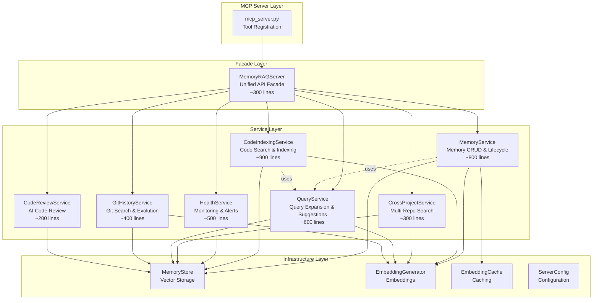

# REF-013: Split Monolithic Core Server - Implementation Plan

## Executive Summary

The `src/core/server.py` file has grown to 5,192 lines, containing 72 methods across 5 distinct domains. This monolithic architecture violates the Single Responsibility Principle, making the codebase difficult to test, understand, modify, and maintain. This plan outlines a 6-phase, 4-6 month migration to extract domain-specific services (MemoryService, CodeIndexingService, HealthService, CrossProjectService, QueryService) while maintaining 100% backward compatibility and zero downtime. Success will be measured by: no files >1,000 lines, clear separation of concerns, improved test coverage, and maintained performance benchmarks.

---

## Current State Analysis

### File Statistics
- **Total Lines:** 5,192
- **Total Methods:** 72 (65 async, 7 sync)
- **Imports:** 47 dependencies
- **Components Managed:** 14+ subsystems (store, embeddings, cache, usage tracker, pruner, conversation tracker, query expander, hybrid searcher, cross-project consent, suggestion engine, metrics collector, alert engine, health reporter, capacity planner)
- **MCP Tools Exposed:** 16 tools
- **Lines of Code by Section:**
  - Initialization: ~220 lines
  - Memory operations: ~1,400 lines
  - Code search/indexing: ~1,200 lines
  - Health monitoring: ~800 lines
  - Cross-project: ~300 lines
  - Query/conversation: ~600 lines
  - Utilities: ~500 lines
  - Cleanup: ~10 lines

### Method Classification by Domain

#### 1. MEMORY SERVICE (19 methods, ~1,800 lines)
**Core memory CRUD and lifecycle management**

| Method | Lines | Description | Complexity |
|--------|-------|-------------|------------|
| `store_memory` | ~125 | Store memory with deduplication, classification | High |
| `retrieve_memories` | ~235 | Semantic search with routing, feedback | High |
| `delete_memory` | ~31 | Delete memory by ID | Low |
| `get_memory_by_id` | ~44 | Retrieve single memory | Low |
| `update_memory` | ~125 | Update memory content/metadata | Medium |
| `list_memories` | ~126 | List/filter memories with pagination | Medium |
| `migrate_memory_scope` | ~37 | Change memory scope (global ↔ project) | Low |
| `bulk_reclassify` | ~48 | Bulk update categories | Low |
| `find_duplicate_memories` | ~34 | Detect duplicate memories | Medium |
| `merge_memories` | ~39 | Merge duplicate memories | Medium |
| `export_memories` | ~164 | Export to JSON/Markdown | Medium |
| `import_memories` | ~209 | Import with conflict resolution | High |
| `retrieve_preferences` | ~24 | Retrieve USER_PREFERENCE memories | Low |
| `retrieve_project_context` | ~35 | Retrieve PROJECT_CONTEXT memories | Low |
| `retrieve_session_state` | ~24 | Retrieve SESSION_STATE memories | Low |
| `get_dashboard_stats` | ~82 | Dashboard statistics | Medium |
| `get_recent_activity` | ~35 | Recent memory activity | Low |
| `_classify_context_level` | ~145 | Auto-classify context level | High |
| `_parse_date_filter` | ~59 | Parse date strings | Low |

**Dependencies:**
- `self.store` (MemoryStore)
- `self.embedding_generator` (EmbeddingGenerator)
- `self.embedding_cache` (EmbeddingCache)
- `self.usage_tracker` (UsageTracker)
- Models: MemoryUnit, StoreMemoryRequest, MemoryResult, RetrievalResponse

**State:**
- `self.stats` (memory counters)
- `self.config` (read-only configuration)

---

#### 2. CODE INDEXING SERVICE (14 methods, ~1,600 lines)
**Code parsing, indexing, search, and dependency analysis**

| Method | Lines | Description | Complexity |
|--------|-------|-------------|------------|
| `search_code` | ~250 | Semantic code search with filters | High |
| `find_similar_code` | ~157 | Find similar code snippets | Medium |
| `index_codebase` | ~90 | Index directory for code search | High |
| `reindex_project` | ~126 | Rebuild project index | Medium |
| `get_indexed_files` | ~61 | List indexed files | Low |
| `list_indexed_units` | ~80 | List functions/classes indexed | Low |
| `get_file_dependencies` | ~62 | Get file imports | Medium |
| `get_file_dependents` | ~45 | Get files importing target | Medium |
| `find_dependency_path` | ~64 | Find import path between files | Medium |
| `get_dependency_stats` | ~38 | Dependency statistics | Low |
| `get_dependency_graph` | ~114 | Generate dependency graph | High |
| `_build_dependency_graph` | ~55 | Build graph from dependencies | Medium |
| `_build_dependency_graph_from_store` | ~79 | Build graph from store | Medium |
| `_format_dependency_graph` | ~24 | Format graph for output | Low |

**Dependencies:**
- `self.store` (MemoryStore)
- `self.embedding_generator` (EmbeddingGenerator)
- `src.memory.incremental_indexer` (IncrementalIndexer)
- `src.graph` (DependencyGraph, GraphNode, GraphEdge)
- `src.graph.formatters` (DOTFormatter, JSONFormatter, MermaidFormatter)

**State:**
- `self.stats` (indexing counters)
- `self.project_name` (current project)

---

#### 3. HEALTH & MONITORING SERVICE (9 methods, ~800 lines)
**Performance metrics, alerts, health scoring, dashboard**

| Method | Lines | Description | Complexity |
|--------|-------|-------------|------------|
| `get_performance_metrics` | ~62 | Get current/historical metrics | Medium |
| `get_active_alerts` | ~65 | Get system alerts | Low |
| `get_health_score` | ~46 | Overall health score | Medium |
| `start_dashboard` | ~58 | Start web dashboard server | Medium |
| `get_capacity_forecast` | ~20 | Forecast capacity needs | Low |
| `resolve_alert` | ~28 | Mark alert as resolved | Low |
| `get_weekly_report` | ~81 | Generate weekly summary | Medium |
| `_calculate_simple_health_score` | ~22 | Calculate 0-100 health score | Low |
| `_collect_metrics_job` | ~27 | Background metrics collection | Low |

**Dependencies:**
- `self.metrics_collector` (MetricsCollector)
- `self.alert_engine` (AlertEngine)
- `self.health_reporter` (HealthReporter)
- `self.capacity_planner` (CapacityPlanner)
- `src.dashboard.web_server` (DashboardServer)

**State:**
- `self.stats` (performance counters)
- Monitoring database (external state)

---

#### 4. CROSS-PROJECT SERVICE (3 methods, ~250 lines)
**Multi-repository search and consent management**

| Method | Lines | Description | Complexity |
|--------|-------|-------------|------------|
| `search_all_projects` | ~163 | Search across opted-in projects | High |
| `opt_in_cross_project` | ~26 | Enable project in cross-search | Low |
| `opt_out_cross_project` | ~26 | Disable project in cross-search | Low |
| `list_opted_in_projects` | ~30 | List opted-in projects | Low |

**Dependencies:**
- `self.cross_project_consent` (CrossProjectConsent)
- `src.memory.multi_repository_search` (MultiRepositorySearcher)
- `self.embedding_generator` (EmbeddingGenerator)

**State:**
- Consent file (external state)
- `self.config` (cross-project settings)

---

#### 5. QUERY & CONVERSATION SERVICE (12 methods, ~900 lines)
**Query expansion, conversation tracking, proactive suggestions, search quality**

| Method | Lines | Description | Complexity |
|--------|-------|-------------|------------|
| `start_conversation_session` | ~47 | Begin conversation tracking | Low |
| `end_conversation_session` | ~43 | End conversation, analyze | Medium |
| `list_conversation_sessions` | ~35 | List tracked conversations | Low |
| `analyze_conversation` | ~48 | Analyze for suggestions | High |
| `get_suggestion_stats` | ~32 | Suggestion system stats | Low |
| `provide_suggestion_feedback` | ~62 | Record suggestion feedback | Low |
| `set_suggestion_mode` | ~60 | Configure suggestion behavior | Low |
| `submit_search_feedback` | ~45 | Record search quality feedback | Low |
| `get_quality_metrics` | ~34 | Search quality metrics | Low |
| `_analyze_search_quality` | ~109 | Analyze search result quality | High |
| `_get_confidence_label` | ~17 | Map confidence to label | Low |
| `find_usages` | ~73 | Find code usages | Medium |
| `suggest_refactorings` | ~137 | Suggest code improvements | High |

**Dependencies:**
- `self.conversation_tracker` (ConversationTracker)
- `self.query_expander` (QueryExpander)
- `self.suggestion_engine` (SuggestionEngine)
- `self.hybrid_searcher` (HybridSearcher)

**State:**
- `self.stats` (query counters)
- Conversation database (external state)

---

#### 6. GIT HISTORY SERVICE (3 methods, ~400 lines)
**Git commit indexing and semantic history search**

| Method | Lines | Description | Complexity |
|--------|-------|-------------|------------|
| `search_git_history` | ~119 | Search commits semantically | High |
| `index_git_history` | ~125 | Index git commits | High |
| `show_function_evolution` | ~82 | Track function changes over time | Medium |

**Dependencies:**
- `self.store` (MemoryStore)
- `src.memory.git_indexer` (GitIndexer)
- `self.embedding_generator` (EmbeddingGenerator)

**State:**
- Git repositories (external state)

---

#### 7. CODE REVIEW SERVICE (1 method, ~200 lines)
**AI-powered code review and suggestions**

| Method | Lines | Description | Complexity |
|--------|-------|-------------|------------|
| `review_code` | ~171 | Review code for issues/improvements | High |

**Dependencies:**
- `self.store` (MemoryStore)
- Pattern matching and heuristics

**State:**
- Code review patterns

---

#### 8. CORE/INFRASTRUCTURE (11 methods)
**Initialization, lifecycle, utilities**

| Method | Lines | Description | Complexity |
|--------|-------|-------------|------------|
| `__init__` | ~64 | Initialize server components | Medium |
| `initialize` | ~163 | Async component initialization | High |
| `_detect_project` | ~22 | Detect git project name | Low |
| `get_status` | ~36 | Overall system status | Medium |
| `get_token_analytics` | ~59 | Token usage analytics | Medium |
| `_get_embedding` | ~23 | Get text embedding | Low |
| `_start_pruning_scheduler` | ~50 | Start background scheduler | Medium |
| `_auto_prune_job` | ~29 | Auto-prune old memories | Low |
| `close` | ~10 | Cleanup resources | Low |

---

## Proposed Architecture

### Service Layer Design



### Service Interfaces

#### 1. MemoryService

```python
# src/services/memory_service.py

from typing import Dict, Any, List, Optional
from datetime import datetime

class MemoryService:
    """
    Service for memory storage, retrieval, and lifecycle management.

    Responsibilities:
    - Store/retrieve/update/delete memories
    - Memory deduplication and merging
    - Context-level classification
    - Import/export functionality
    - Memory listing and filtering
    """

    def __init__(
        self,
        store: MemoryStore,
        embedding_generator: EmbeddingGenerator,
        embedding_cache: EmbeddingCache,
        usage_tracker: Optional[UsageTracker] = None,
        config: ServerConfig = None
    ):
        self.store = store
        self.embedding_generator = embedding_generator
        self.embedding_cache = embedding_cache
        self.usage_tracker = usage_tracker
        self.config = config
        self.stats = {}  # Memory operation statistics

    async def store_memory(
        self,
        content: str,
        category: str,
        importance: float = 0.5,
        tags: Optional[List[str]] = None,
        **kwargs
    ) -> Dict[str, Any]:
        """Store a memory with automatic classification and deduplication."""
        pass

    async def retrieve_memories(
        self,
        query: str,
        limit: int = 10,
        min_importance: float = 0.0,
        filters: Optional[Dict[str, Any]] = None
    ) -> Dict[str, Any]:
        """Retrieve memories using semantic search."""
        pass

    async def update_memory(
        self,
        memory_id: str,
        content: Optional[str] = None,
        metadata: Optional[Dict[str, Any]] = None
    ) -> Dict[str, Any]:
        """Update memory content or metadata."""
        pass

    async def delete_memory(self, memory_id: str) -> Dict[str, Any]:
        """Delete a memory by ID."""
        pass

    async def list_memories(
        self,
        filters: Optional[Dict[str, Any]] = None,
        limit: int = 50,
        offset: int = 0
    ) -> Dict[str, Any]:
        """List memories with filtering and pagination."""
        pass

    async def find_duplicate_memories(
        self,
        threshold: float = 0.95
    ) -> List[Dict[str, Any]]:
        """Find potential duplicate memories."""
        pass

    async def merge_memories(
        self,
        memory_ids: List[str],
        strategy: str = "merge_content"
    ) -> Dict[str, Any]:
        """Merge multiple memories into one."""
        pass

    async def export_memories(
        self,
        output_path: str,
        format: str = "json",
        filters: Optional[Dict[str, Any]] = None
    ) -> Dict[str, Any]:
        """Export memories to file."""
        pass

    async def import_memories(
        self,
        file_path: str,
        conflict_mode: str = "skip"
    ) -> Dict[str, Any]:
        """Import memories from file."""
        pass

    def get_stats(self) -> Dict[str, Any]:
        """Get memory service statistics."""
        return self.stats
```

#### 2. CodeIndexingService

```python
# src/services/code_indexing_service.py

from typing import Dict, Any, List, Optional
from pathlib import Path

class CodeIndexingService:
    """
    Service for code indexing, search, and dependency analysis.

    Responsibilities:
    - Index codebases for semantic search
    - Search code semantically
    - Find similar code snippets
    - Analyze dependencies and relationships
    - Track indexed files and units
    """

    def __init__(
        self,
        store: MemoryStore,
        embedding_generator: EmbeddingGenerator,
        config: ServerConfig,
        project_name: Optional[str] = None
    ):
        self.store = store
        self.embedding_generator = embedding_generator
        self.config = config
        self.project_name = project_name
        self.stats = {}  # Indexing statistics

    async def index_codebase(
        self,
        directory_path: str,
        project_name: Optional[str] = None,
        recursive: bool = True,
        force_reindex: bool = False
    ) -> Dict[str, Any]:
        """Index a codebase directory."""
        pass

    async def reindex_project(
        self,
        project_name: str,
        force: bool = False
    ) -> Dict[str, Any]:
        """Rebuild index for a project."""
        pass

    async def search_code(
        self,
        query: str,
        project_name: Optional[str] = None,
        limit: int = 5,
        filters: Optional[Dict[str, Any]] = None
    ) -> Dict[str, Any]:
        """Search indexed code semantically."""
        pass

    async def find_similar_code(
        self,
        code_snippet: str,
        limit: int = 5,
        project_name: Optional[str] = None
    ) -> Dict[str, Any]:
        """Find similar code snippets."""
        pass

    async def get_indexed_files(
        self,
        project_name: Optional[str] = None,
        filters: Optional[Dict[str, Any]] = None
    ) -> Dict[str, Any]:
        """List indexed files."""
        pass

    async def list_indexed_units(
        self,
        project_name: Optional[str] = None,
        unit_type: Optional[str] = None,
        limit: int = 100
    ) -> Dict[str, Any]:
        """List indexed code units (functions, classes)."""
        pass

    async def get_file_dependencies(
        self,
        file_path: str,
        project_name: Optional[str] = None
    ) -> Dict[str, Any]:
        """Get dependencies for a file."""
        pass

    async def get_dependency_graph(
        self,
        project_name: Optional[str] = None,
        format: str = "json",
        depth: Optional[int] = None
    ) -> Dict[str, Any]:
        """Generate dependency graph."""
        pass

    def get_stats(self) -> Dict[str, Any]:
        """Get indexing service statistics."""
        return self.stats
```

#### 3. HealthService

```python
# src/services/health_service.py

from typing import Dict, Any, Optional

class HealthService:
    """
    Service for health monitoring, metrics, and alerting.

    Responsibilities:
    - Collect and report performance metrics
    - Monitor system health
    - Generate alerts for issues
    - Provide capacity forecasting
    - Generate health reports
    """

    def __init__(
        self,
        metrics_collector: MetricsCollector,
        alert_engine: AlertEngine,
        health_reporter: HealthReporter,
        capacity_planner: CapacityPlanner,
        store: MemoryStore,
        config: ServerConfig
    ):
        self.metrics_collector = metrics_collector
        self.alert_engine = alert_engine
        self.health_reporter = health_reporter
        self.capacity_planner = capacity_planner
        self.store = store
        self.config = config

    async def get_performance_metrics(
        self,
        include_history_days: int = 7
    ) -> Dict[str, Any]:
        """Get current and historical performance metrics."""
        pass

    async def get_health_score(self) -> Dict[str, Any]:
        """Get overall system health score (0-100)."""
        pass

    async def get_active_alerts(
        self,
        severity_filter: Optional[str] = None
    ) -> Dict[str, Any]:
        """Get active system alerts."""
        pass

    async def resolve_alert(self, alert_id: str) -> Dict[str, Any]:
        """Mark alert as resolved."""
        pass

    async def get_capacity_forecast(
        self,
        days_ahead: int = 30
    ) -> Dict[str, Any]:
        """Forecast capacity needs."""
        pass

    async def get_weekly_report(self) -> Dict[str, Any]:
        """Generate weekly health summary."""
        pass

    async def start_dashboard(
        self,
        port: int = 8080,
        host: str = "localhost"
    ) -> Dict[str, Any]:
        """Start web dashboard server."""
        pass

    async def collect_metrics_snapshot(self) -> None:
        """Collect and store current metrics."""
        pass
```

#### 4. CrossProjectService

```python
# src/services/cross_project_service.py

from typing import Dict, Any, List, Optional

class CrossProjectService:
    """
    Service for multi-repository search and consent management.

    Responsibilities:
    - Search across multiple projects
    - Manage cross-project consent
    - Track opted-in projects
    """

    def __init__(
        self,
        store: MemoryStore,
        embedding_generator: EmbeddingGenerator,
        cross_project_consent: CrossProjectConsent,
        config: ServerConfig
    ):
        self.store = store
        self.embedding_generator = embedding_generator
        self.consent = cross_project_consent
        self.config = config

    async def search_all_projects(
        self,
        query: str,
        search_mode: str = "semantic",
        limit: int = 10
    ) -> Dict[str, Any]:
        """Search across all opted-in projects."""
        pass

    async def opt_in_cross_project(
        self,
        project_name: str
    ) -> Dict[str, Any]:
        """Enable project for cross-project search."""
        pass

    async def opt_out_cross_project(
        self,
        project_name: str
    ) -> Dict[str, Any]:
        """Disable project from cross-project search."""
        pass

    async def list_opted_in_projects(self) -> Dict[str, Any]:
        """List all opted-in projects."""
        pass
```

#### 5. QueryService

```python
# src/services/query_service.py

from typing import Dict, Any, List, Optional

class QueryService:
    """
    Service for query expansion, conversation tracking, and proactive suggestions.

    Responsibilities:
    - Expand and optimize queries
    - Track conversation sessions
    - Generate proactive suggestions
    - Collect search quality feedback
    """

    def __init__(
        self,
        conversation_tracker: Optional[ConversationTracker],
        query_expander: Optional[QueryExpander],
        suggestion_engine: Optional[SuggestionEngine],
        hybrid_searcher: Optional[HybridSearcher],
        config: ServerConfig
    ):
        self.conversation_tracker = conversation_tracker
        self.query_expander = query_expander
        self.suggestion_engine = suggestion_engine
        self.hybrid_searcher = hybrid_searcher
        self.config = config
        self.stats = {}

    async def start_conversation_session(
        self,
        session_id: str,
        context: Optional[Dict[str, Any]] = None
    ) -> Dict[str, Any]:
        """Start tracking a conversation session."""
        pass

    async def end_conversation_session(
        self,
        session_id: str
    ) -> Dict[str, Any]:
        """End conversation session and analyze."""
        pass

    async def analyze_conversation(
        self,
        messages: List[str],
        session_id: Optional[str] = None
    ) -> Dict[str, Any]:
        """Analyze conversation for suggestions."""
        pass

    async def submit_search_feedback(
        self,
        query: str,
        results: List[Dict[str, Any]],
        feedback: str
    ) -> Dict[str, Any]:
        """Submit search quality feedback."""
        pass

    async def get_suggestion_stats(self) -> Dict[str, Any]:
        """Get suggestion system statistics."""
        pass

    async def set_suggestion_mode(
        self,
        mode: str,
        confidence_threshold: Optional[float] = None
    ) -> Dict[str, Any]:
        """Configure suggestion behavior."""
        pass

    def get_stats(self) -> Dict[str, Any]:
        """Get query service statistics."""
        return self.stats
```

#### 6. GitHistoryService

```python
# src/services/git_history_service.py

from typing import Dict, Any, Optional

class GitHistoryService:
    """
    Service for git history indexing and semantic search.

    Responsibilities:
    - Index git commits and history
    - Search commits semantically
    - Track function evolution over time
    """

    def __init__(
        self,
        store: MemoryStore,
        embedding_generator: EmbeddingGenerator,
        config: ServerConfig
    ):
        self.store = store
        self.embedding_generator = embedding_generator
        self.config = config

    async def index_git_history(
        self,
        repo_path: str,
        project_name: Optional[str] = None,
        max_commits: int = 1000
    ) -> Dict[str, Any]:
        """Index git commit history."""
        pass

    async def search_git_history(
        self,
        query: str,
        repo_path: Optional[str] = None,
        limit: int = 10
    ) -> Dict[str, Any]:
        """Search git commits semantically."""
        pass

    async def show_function_evolution(
        self,
        function_name: str,
        file_path: str,
        repo_path: str
    ) -> Dict[str, Any]:
        """Track how a function changed over time."""
        pass
```

#### 7. CodeReviewService

```python
# src/services/code_review_service.py

from typing import Dict, Any, List

class CodeReviewService:
    """
    Service for AI-powered code review and suggestions.

    Responsibilities:
    - Review code for issues and improvements
    - Suggest refactorings
    - Find code usages
    """

    def __init__(
        self,
        store: MemoryStore,
        config: ServerConfig
    ):
        self.store = store
        self.config = config

    async def review_code(
        self,
        code: str,
        language: Optional[str] = None,
        context: Optional[str] = None
    ) -> Dict[str, Any]:
        """Review code for issues and improvements."""
        pass

    async def suggest_refactorings(
        self,
        code: str,
        file_path: Optional[str] = None
    ) -> Dict[str, Any]:
        """Suggest code refactorings."""
        pass

    async def find_usages(
        self,
        symbol: str,
        project_name: Optional[str] = None
    ) -> Dict[str, Any]:
        """Find usages of a symbol."""
        pass
```

#### 8. MemoryRAGServer (Facade)

```python
# src/core/server.py (refactored)

class MemoryRAGServer:
    """
    Facade providing unified API for all services.

    This is a thin wrapper that delegates to specialized services
    while maintaining backward compatibility with existing MCP tools.
    """

    def __init__(self, config: Optional[ServerConfig] = None):
        self.config = config or get_config()
        self.project_name = self._detect_project()

        # Services (initialized in initialize())
        self.memory_service: Optional[MemoryService] = None
        self.code_indexing_service: Optional[CodeIndexingService] = None
        self.health_service: Optional[HealthService] = None
        self.cross_project_service: Optional[CrossProjectService] = None
        self.query_service: Optional[QueryService] = None
        self.git_history_service: Optional[GitHistoryService] = None
        self.code_review_service: Optional[CodeReviewService] = None

        # Infrastructure components
        self.store: Optional[MemoryStore] = None
        self.embedding_generator: Optional[EmbeddingGenerator] = None
        self.embedding_cache: Optional[EmbeddingCache] = None

        # Legacy stats (aggregated from services)
        self.stats = {}

    async def initialize(self, defer_preload: bool = False) -> None:
        """Initialize all services."""
        # Initialize infrastructure
        self.store = create_memory_store(config=self.config)
        await self.store.initialize()

        self.embedding_generator = EmbeddingGenerator(self.config)
        if not defer_preload:
            await self.embedding_generator.initialize()

        self.embedding_cache = EmbeddingCache(self.config)

        # Initialize services
        self.memory_service = MemoryService(
            store=self.store,
            embedding_generator=self.embedding_generator,
            embedding_cache=self.embedding_cache,
            config=self.config
        )

        self.code_indexing_service = CodeIndexingService(
            store=self.store,
            embedding_generator=self.embedding_generator,
            config=self.config,
            project_name=self.project_name
        )

        self.health_service = HealthService(
            metrics_collector=...,
            alert_engine=...,
            health_reporter=...,
            capacity_planner=...,
            store=self.store,
            config=self.config
        )

        # ... initialize other services

    # Facade methods - delegate to services
    async def store_memory(self, *args, **kwargs):
        return await self.memory_service.store_memory(*args, **kwargs)

    async def retrieve_memories(self, *args, **kwargs):
        return await self.memory_service.retrieve_memories(*args, **kwargs)

    async def search_code(self, *args, **kwargs):
        return await self.code_indexing_service.search_code(*args, **kwargs)

    # ... all other methods delegate to appropriate service
```

---

## Migration Plan

### Phase 0: Preparation (1 week)

**Goal:** Set up infrastructure for safe refactoring

**Tasks:**
1. **Create service directory structure**
   - `mkdir -p src/services`
   - Create `__init__.py` with exports

2. **Establish baseline metrics**
   - Run full test suite: `pytest tests/ -v --cov=src`
   - Document current test count and coverage
   - Run performance benchmarks
   - Save results as baseline in `planning_docs/REF-013_baseline.md`

3. **Create integration test suite for MemoryRAGServer**
   - Test all 16 MCP tools end-to-end
   - Mock external dependencies (Qdrant, file system)
   - Save as `tests/integration/test_server_facade.py`
   - These tests will ensure backward compatibility throughout migration

4. **Set up regression testing automation**
   - GitHub Actions workflow to run tests on every commit
   - Performance regression detection (alert if >10% slower)

5. **Document current API contracts**
   - List all method signatures in `planning_docs/REF-013_api_contracts.md`
   - Include parameter types, return types, exceptions
   - This is the contract we must maintain

**Success Criteria:**
- ✅ Test suite passes (100% of current passing tests)
- ✅ Performance baseline documented
- ✅ Integration tests created
- ✅ API contracts documented

**Risks:**
- Test suite has failures → Fix before starting migration
- Performance benchmarks inconsistent → Run multiple times, take average

---

### Phase 1: Extract MemoryService (3-4 weeks)

**Goal:** Extract memory CRUD operations into standalone service

**Week 1: Create MemoryService skeleton**
1. Create `src/services/memory_service.py`
2. Define class with all 19 method signatures (empty implementations)
3. Add type hints and docstrings
4. Create `tests/unit/services/test_memory_service.py` with test structure
5. Import MemoryService in `src/services/__init__.py`

**Week 2: Migrate simple methods (8 methods)**
- `delete_memory` (31 lines)
- `get_memory_by_id` (44 lines)
- `retrieve_preferences` (24 lines)
- `retrieve_project_context` (35 lines)
- `retrieve_session_state` (24 lines)
- `get_recent_activity` (35 lines)
- `migrate_memory_scope` (37 lines)
- `bulk_reclassify` (48 lines)

**Process for each method:**
1. Copy method from server.py to MemoryService
2. Update to use `self.store`, `self.embedding_generator`, etc.
3. Write unit tests (test success path, error paths, edge cases)
4. Update server.py to delegate to service
5. Run integration tests to verify backward compatibility
6. Commit with message: "REF-013: Migrate {method_name} to MemoryService"

**Week 3: Migrate complex methods (6 methods)**
- `store_memory` (125 lines) - most critical, test thoroughly
- `retrieve_memories` (235 lines) - high complexity, many code paths
- `update_memory` (125 lines)
- `list_memories` (126 lines)
- `export_memories` (164 lines)
- `import_memories` (209 lines)

**Week 4: Migrate remaining methods and polish**
- `find_duplicate_memories` (34 lines)
- `merge_memories` (39 lines)
- `get_dashboard_stats` (82 lines)
- `_classify_context_level` (145 lines)
- `_parse_date_filter` (59 lines)
- Add comprehensive integration tests
- Update documentation

**Success Criteria:**
- ✅ MemoryService has 19 methods, all tested
- ✅ Unit test coverage for MemoryService >90%
- ✅ All server.py memory methods delegate to MemoryService
- ✅ Integration tests pass (no behavioral changes)
- ✅ Performance benchmarks unchanged (±5%)

**Deliverables:**
- `src/services/memory_service.py` (~800 lines)
- `tests/unit/services/test_memory_service.py` (~1,500 lines)
- Updated `src/core/server.py` (delegating methods)
- Documentation: `docs/services/memory_service.md`

---

### Phase 2: Extract CodeIndexingService (3-4 weeks)

**Goal:** Extract code indexing, search, and dependency analysis

**Week 1: Create CodeIndexingService skeleton**
1. Create `src/services/code_indexing_service.py`
2. Define class with all 14 method signatures
3. Add type hints and docstrings
4. Create `tests/unit/services/test_code_indexing_service.py`

**Week 2: Migrate search methods (4 methods)**
- `search_code` (250 lines) - critical, test all search modes
- `find_similar_code` (157 lines)
- `get_indexed_files` (61 lines)
- `list_indexed_units` (80 lines)

**Week 3: Migrate indexing methods (3 methods)**
- `index_codebase` (90 lines) - critical, test with real files
- `reindex_project` (126 lines)
- Test with multiple languages and file types

**Week 4: Migrate dependency methods (7 methods)**
- `get_file_dependencies` (62 lines)
- `get_file_dependents` (45 lines)
- `find_dependency_path` (64 lines)
- `get_dependency_stats` (38 lines)
- `get_dependency_graph` (114 lines)
- `_build_dependency_graph` (55 lines)
- `_build_dependency_graph_from_store` (79 lines)
- `_format_dependency_graph` (24 lines)

**Success Criteria:**
- ✅ CodeIndexingService has 14 methods, all tested
- ✅ Unit test coverage >90%
- ✅ Integration tests pass
- ✅ Code search performance unchanged (7-13ms semantic, 3-7ms keyword)
- ✅ Indexing performance unchanged (10-20 files/sec)

**Deliverables:**
- `src/services/code_indexing_service.py` (~900 lines)
- `tests/unit/services/test_code_indexing_service.py` (~1,800 lines)
- Updated `src/core/server.py`
- Documentation: `docs/services/code_indexing_service.md`

---

### Phase 3: Extract HealthService (2-3 weeks)

**Goal:** Extract health monitoring, metrics, and alerting

**Week 1: Create HealthService skeleton and migrate simple methods**
1. Create `src/services/health_service.py`
2. Migrate simple methods:
   - `get_performance_metrics` (62 lines)
   - `get_active_alerts` (65 lines)
   - `get_capacity_forecast` (20 lines)
   - `resolve_alert` (28 lines)
   - `_calculate_simple_health_score` (22 lines)
   - `_collect_metrics_job` (27 lines)

**Week 2: Migrate complex methods**
- `get_health_score` (46 lines)
- `start_dashboard` (58 lines) - test web server startup/shutdown
- `get_weekly_report` (81 lines)

**Week 3: Integration and testing**
- Ensure metrics collection works in background
- Test alert generation and resolution
- Test dashboard startup on different ports
- Integration tests with real monitoring database

**Success Criteria:**
- ✅ HealthService has 9 methods, all tested
- ✅ Metrics collection continues in background
- ✅ Dashboard starts correctly
- ✅ Health score calculation accurate

**Deliverables:**
- `src/services/health_service.py` (~500 lines)
- `tests/unit/services/test_health_service.py` (~900 lines)
- Updated `src/core/server.py`
- Documentation: `docs/services/health_service.md`

---

### Phase 4: Extract Remaining Services (3-4 weeks)

**Goal:** Extract CrossProjectService, QueryService, GitHistoryService, CodeReviewService

**Week 1: CrossProjectService (4 methods)**
- Create `src/services/cross_project_service.py`
- Migrate all 4 methods
- Test cross-project search with multiple projects
- Test consent management

**Week 2: QueryService (12 methods)**
- Create `src/services/query_service.py`
- Migrate conversation tracking (3 methods)
- Migrate suggestion system (4 methods)
- Migrate search quality (2 methods)
- Migrate code analysis (3 methods)

**Week 3: GitHistoryService (3 methods)**
- Create `src/services/git_history_service.py`
- Migrate git indexing and search
- Test with real git repositories

**Week 4: CodeReviewService (3 methods)**
- Create `src/services/code_review_service.py`
- Migrate code review and refactoring suggestions
- Integration testing

**Success Criteria:**
- ✅ All 4 services created and tested
- ✅ CrossProjectService: 4 methods, >90% coverage
- ✅ QueryService: 12 methods, >85% coverage
- ✅ GitHistoryService: 3 methods, >85% coverage
- ✅ CodeReviewService: 3 methods, >85% coverage

**Deliverables:**
- 4 service modules (~1,500 lines total)
- 4 test modules (~3,000 lines total)
- Updated `src/core/server.py`
- Documentation for all services

---

### Phase 5: Refactor Facade and Cleanup (2-3 weeks)

**Goal:** Clean up server.py, optimize facade, remove duplication

**Week 1: Optimize facade delegation**
1. Review all delegation methods in MemoryRAGServer
2. Simplify delegation patterns (use `__getattr__` if appropriate)
3. Consolidate stats aggregation from services
4. Optimize initialization order

**Week 2: Remove duplication and dead code**
1. Scan for duplicated logic between services
2. Extract common patterns to utilities
3. Remove commented-out code
4. Consolidate imports

**Week 3: Final cleanup and validation**
1. Run full test suite
2. Run performance benchmarks
3. Check test coverage (should be higher than baseline)
4. Code review of all changes
5. Update all documentation

**Success Criteria:**
- ✅ `src/core/server.py` < 500 lines (facade only)
- ✅ No files >1,000 lines in `src/services/`
- ✅ All tests passing (100% of original + new service tests)
- ✅ Test coverage improved (target: 75%+ overall, 85%+ for services)
- ✅ Performance benchmarks within ±5% of baseline
- ✅ No behavioral changes (integration tests prove this)

**Deliverables:**
- Optimized `src/core/server.py` (~300-500 lines)
- Service utility modules if needed
- Updated test suite
- Performance comparison report

---

### Phase 6: Documentation and Release (1-2 weeks)

**Goal:** Document architecture, update guides, prepare release

**Week 1: Documentation**
1. Update `docs/architecture.md` with new service layer
2. Create `docs/services/` directory with guides for each service
3. Update `CHANGELOG.md` with REF-013 completion
4. Update `CLAUDE.md` with new architecture notes
5. Create migration guide for developers extending the codebase
6. Update API documentation

**Week 2: Testing and release preparation**
1. Run comprehensive E2E testing (TEST-006)
2. Performance regression testing
3. Security audit (ensure no new vulnerabilities)
4. Update `TODO.md` (mark REF-013 complete)
5. Create release notes for v4.1 or v5.0
6. Tag release in git

**Success Criteria:**
- ✅ All documentation updated
- ✅ Migration guide created
- ✅ E2E tests passing
- ✅ Security audit clean
- ✅ Release tagged

**Deliverables:**
- Updated documentation (8+ files)
- Migration guide for developers
- Release notes
- Git tag

---

## Backward Compatibility Strategy

### 1. Facade Pattern

The `MemoryRAGServer` class will remain as the primary entry point with **zero API changes**. All existing methods will be preserved, simply delegating to the appropriate service:

```python
class MemoryRAGServer:
    async def store_memory(self, content: str, category: str, **kwargs) -> Dict[str, Any]:
        """Original method signature preserved - delegates to service."""
        return await self.memory_service.store_memory(content, category, **kwargs)
```

### 2. MCP Tool Compatibility

The `src/mcp_server.py` file requires **zero changes**. It will continue to call methods on `MemoryRAGServer` exactly as before. The refactoring is completely transparent to MCP clients.

### 3. Import Compatibility

For code that imports `MemoryRAGServer`:

```python
# This will continue to work unchanged
from src.core.server import MemoryRAGServer

server = MemoryRAGServer()
await server.initialize()
await server.store_memory(...)
```

### 4. Stats Compatibility

The `server.stats` dictionary will be maintained as an aggregated view of all service stats:

```python
@property
def stats(self) -> Dict[str, Any]:
    """Aggregate stats from all services."""
    aggregated = {}
    if self.memory_service:
        aggregated.update(self.memory_service.get_stats())
    if self.code_indexing_service:
        aggregated.update(self.code_indexing_service.get_stats())
    # ... aggregate from all services
    return aggregated
```

### 5. Configuration Compatibility

The `ServerConfig` class remains unchanged. Services receive config in their constructors.

### 6. Deprecation Strategy

**No deprecations needed** - this is a pure internal refactoring. The public API surface remains identical.

### 7. Testing Backward Compatibility

The integration test suite (`tests/integration/test_server_facade.py`) will verify:
- All MCP tools work identically before/after refactoring
- Response structures unchanged
- Error messages unchanged
- Performance within ±5%

**Acceptance criteria:** All integration tests must pass before and after each phase.

---

## Testing Strategy

### 1. Unit Testing (per service)

**Target:** >90% coverage for each service

**Structure:**
```
tests/unit/services/
├── test_memory_service.py (~1,500 lines)
│   ├── Test store_memory (success, dedup, classification)
│   ├── Test retrieve_memories (semantic search, filters)
│   ├── Test update/delete/list operations
│   ├── Test import/export (all formats, conflicts)
│   └── Test edge cases (empty results, invalid inputs)
├── test_code_indexing_service.py (~1,800 lines)
│   ├── Test indexing (Python, JS, multiple languages)
│   ├── Test search (semantic, filters, pagination)
│   ├── Test dependencies (parsing, graph generation)
│   └── Test edge cases (empty projects, parse errors)
├── test_health_service.py (~900 lines)
│   ├── Test metrics collection (scheduling, storage)
│   ├── Test alerts (generation, resolution)
│   ├── Test health scoring (calculation, thresholds)
│   └── Test dashboard (startup, shutdown)
├── test_cross_project_service.py (~400 lines)
├── test_query_service.py (~1,200 lines)
├── test_git_history_service.py (~600 lines)
└── test_code_review_service.py (~400 lines)
```

**Total new tests:** ~6,800 lines of unit tests

### 2. Integration Testing

**File:** `tests/integration/test_server_facade.py`

**Purpose:** Verify MemoryRAGServer facade maintains exact same behavior

**Test cases:**
- All 16 MCP tools (end-to-end)
- Error handling (test all exception paths)
- Stats aggregation (verify counters increment correctly)
- Initialization (test with different configs)
- Cleanup (test close() method)

**Execution:** Run before and after each migration phase, save results, compare

### 3. Regression Testing

**Automated:**
- GitHub Actions workflow triggers on every commit
- Run full test suite (unit + integration)
- Run performance benchmarks
- Alert if performance degrades >10%
- Alert if test coverage decreases

**Manual:**
- Weekly smoke tests of all MCP tools via Claude Desktop
- Test with real codebases (this project, sample projects)

### 4. Performance Testing

**Benchmarks to maintain:**
- Search latency: 7-13ms (semantic), 3-7ms (keyword), 10-18ms (hybrid)
- Indexing throughput: 10-20 files/sec (parallel mode)
- Memory operations: <50ms (store), <20ms (retrieve)

**Method:**
```bash
# Run before migration
pytest tests/performance/test_benchmarks.py --benchmark-save=baseline

# Run after each phase
pytest tests/performance/test_benchmarks.py --benchmark-compare=baseline
```

### 5. Test Coverage Tracking

**Current:** 59.6% overall, 71.2% core modules

**Target after REF-013:**
- Overall: 65%+ (increase of 5.4%)
- Services: 85%+ (new code should be well-tested)
- Core facade: 90%+ (simple delegation should be easy to test)

**Measurement:**
```bash
pytest tests/ --cov=src --cov-report=html --cov-report=term-missing
```

---

## Risks and Mitigations

### Risk 1: Breaking Changes in Delegation

**Impact:** High - Could break all MCP tools
**Probability:** Medium - Easy to make subtle mistakes in delegation

**Mitigation:**
1. Write integration tests BEFORE migration (Phase 0)
2. Run integration tests after EVERY method migration
3. Use type hints and mypy to catch signature mismatches
4. Code review all delegation methods
5. Test with real MCP client (Claude Desktop)

**Contingency:**
- If integration tests fail, immediately revert the change
- Fix the issue in the service, then retry delegation

---

### Risk 2: Performance Degradation

**Impact:** High - User experience suffers if search becomes slow
**Probability:** Low - Services add minimal overhead

**Mitigation:**
1. Establish baseline benchmarks (Phase 0)
2. Run benchmarks after each phase
3. Profile with `cProfile` if degradation detected
4. Optimize hot paths (e.g., remove unnecessary async/await)
5. Consider caching if needed

**Contingency:**
- If degradation >10%, halt migration and investigate
- Profile to find bottleneck
- Optimize before continuing

---

### Risk 3: State Management Issues

**Impact:** Medium - Stats or state could become inconsistent
**Probability:** Medium - Multiple services share state

**Mitigation:**
1. Clear ownership of state (each service owns its stats)
2. Facade aggregates stats via property (not cached)
3. No shared mutable state between services
4. Document state ownership in service docstrings

**Contingency:**
- If state inconsistencies found, add locks or make state immutable
- Consider using events for state synchronization

---

### Risk 4: Incomplete Migration

**Impact:** Medium - Codebase in inconsistent state
**Probability:** Low - Phased approach prevents this

**Mitigation:**
1. Migrate one service at a time (complete each phase fully)
2. Don't start Phase N+1 until Phase N is 100% complete
3. Each phase has clear success criteria
4. Track progress in `planning_docs/REF-013_progress.md`

**Contingency:**
- If a phase stalls, pause and reassess
- Break phase into smaller sub-phases if needed

---

### Risk 5: Test Coverage Gaps

**Impact:** Medium - Bugs slip through if tests insufficient
**Probability:** Medium - Complex methods are hard to test

**Mitigation:**
1. Aim for >90% unit test coverage per service
2. Write tests for edge cases (empty results, errors, edge inputs)
3. Use mutation testing to verify test quality (optional)
4. Code review all test suites
5. Run coverage reports after each phase

**Contingency:**
- If coverage <85%, add more tests before proceeding
- Identify untested code paths with `coverage report --show-missing`

---

### Risk 6: Documentation Drift

**Impact:** Low - Developers confused by outdated docs
**Probability:** Medium - Documentation often lags code

**Mitigation:**
1. Update docs incrementally (add service docs in each phase)
2. Final documentation phase (Phase 6) before release
3. Include documentation in code review
4. Link docs from service docstrings

**Contingency:**
- If docs incomplete, delay release until updated

---

### Risk 7: Team Bandwidth

**Impact:** High - Migration could stall if team is busy
**Probability:** Medium - 4-6 months is a long commitment

**Mitigation:**
1. Break into small, manageable phases (2-4 weeks each)
2. Allow pauses between phases if needed
3. Track progress transparently in `TODO.md` and planning docs
4. Celebrate milestones (each phase completion)

**Contingency:**
- If bandwidth is insufficient, extend timeline
- Consider pausing to focus on critical bugs/features

---

### Risk 8: Merge Conflicts in Worktree

**Impact:** Medium - Conflicts when merging feature branches
**Probability:** High - Large refactor touches many files

**Mitigation:**
1. Use git worktree for REF-013 work (per CLAUDE.md workflow)
2. Sync with main branch regularly (`git merge origin/main`)
3. Keep changes focused on one service per phase
4. Avoid mixing refactoring with new features

**Contingency:**
- If conflicts are severe, resolve manually and run full test suite
- Consider rebasing instead of merging if history is clean

---

## Success Criteria

### Quantitative Metrics

1. **File Size**
   - ✅ No file >1,000 lines in `src/core/` or `src/services/`
   - ✅ `src/core/server.py` reduced from 5,192 to <500 lines (90% reduction)

2. **Test Coverage**
   - ✅ Overall coverage: 65%+ (current 59.6%)
   - ✅ Service coverage: 85%+ for all services
   - ✅ Total tests: 3,200+ (current ~2,740, add ~500 service tests)

3. **Performance**
   - ✅ Search latency within ±5% of baseline (7-13ms semantic)
   - ✅ Indexing throughput within ±5% of baseline (10-20 files/sec)
   - ✅ Memory operations within ±5% of baseline

4. **Architecture**
   - ✅ 7 service modules created (MemoryService, CodeIndexingService, HealthService, CrossProjectService, QueryService, GitHistoryService, CodeReviewService)
   - ✅ Clear separation of concerns (each service <1,000 lines)
   - ✅ Dependency injection (services don't create their own dependencies)

### Qualitative Metrics

5. **Maintainability**
   - ✅ Each service has single, well-defined responsibility
   - ✅ Services are independently testable (mocks available for all deps)
   - ✅ Clear module boundaries (no circular dependencies)

6. **Backward Compatibility**
   - ✅ All 16 MCP tools work identically (integration tests prove this)
   - ✅ No breaking changes to public API
   - ✅ Zero changes required in `src/mcp_server.py`

7. **Documentation**
   - ✅ Each service has comprehensive documentation
   - ✅ Architecture guide updated with service layer diagram
   - ✅ Migration guide for developers
   - ✅ CHANGELOG.md updated

8. **Code Quality**
   - ✅ All services follow consistent patterns
   - ✅ Type hints on all methods
   - ✅ Docstrings on all public methods
   - ✅ No code duplication between services

### Release Readiness

9. **Testing**
   - ✅ Full test suite passing (100% of tests)
   - ✅ No regressions (integration tests before/after comparison)
   - ✅ Performance benchmarks passing

10. **Security**
    - ✅ Security audit passing (no new vulnerabilities)
    - ✅ Read-only mode still works
    - ✅ Input validation unchanged

### Acceptance Criteria (All Must Pass)

- [ ] All quantitative metrics achieved
- [ ] All qualitative metrics achieved
- [ ] Full test suite passing
- [ ] Performance benchmarks within limits
- [ ] Security audit clean
- [ ] Documentation complete
- [ ] Code review approved
- [ ] E2E testing passed (TEST-006)

**Release:** Only proceed to production when all criteria met.

---

## Implementation Checklist

### Phase 0: Preparation ✅ / ❌
- [ ] Create `src/services/` directory
- [ ] Run baseline test suite and save results
- [ ] Document baseline performance metrics
- [ ] Create integration test suite (`test_server_facade.py`)
- [ ] Document API contracts
- [ ] Set up CI/CD regression testing

### Phase 1: MemoryService ✅ / ❌
- [ ] Create `src/services/memory_service.py`
- [ ] Create test file `tests/unit/services/test_memory_service.py`
- [ ] Migrate 8 simple methods (Week 2)
- [ ] Migrate 6 complex methods (Week 3)
- [ ] Migrate 5 remaining methods (Week 4)
- [ ] Update `src/core/server.py` to delegate
- [ ] Run integration tests (all pass)
- [ ] Check performance benchmarks (within ±5%)
- [ ] Write service documentation
- [ ] Code review and merge

### Phase 2: CodeIndexingService ✅ / ❌
- [ ] Create `src/services/code_indexing_service.py`
- [ ] Create test file
- [ ] Migrate search methods (4 methods)
- [ ] Migrate indexing methods (3 methods)
- [ ] Migrate dependency methods (7 methods)
- [ ] Update facade delegation
- [ ] Run integration tests
- [ ] Check performance benchmarks
- [ ] Write documentation
- [ ] Code review and merge

### Phase 3: HealthService ✅ / ❌
- [ ] Create `src/services/health_service.py`
- [ ] Create test file
- [ ] Migrate simple methods (6 methods)
- [ ] Migrate complex methods (3 methods)
- [ ] Test metrics collection in background
- [ ] Test dashboard startup
- [ ] Update facade delegation
- [ ] Run integration tests
- [ ] Write documentation
- [ ] Code review and merge

### Phase 4: Remaining Services ✅ / ❌
- [ ] Create CrossProjectService
- [ ] Create QueryService
- [ ] Create GitHistoryService
- [ ] Create CodeReviewService
- [ ] Write tests for all 4 services
- [ ] Update facade delegation
- [ ] Run integration tests
- [ ] Write documentation
- [ ] Code review and merge

### Phase 5: Cleanup ✅ / ❌
- [ ] Optimize facade delegation patterns
- [ ] Remove code duplication
- [ ] Consolidate stats aggregation
- [ ] Remove dead code
- [ ] Run full test suite
- [ ] Run performance benchmarks
- [ ] Check test coverage (target met)
- [ ] Final code review

### Phase 6: Documentation & Release ✅ / ❌
- [ ] Update `docs/architecture.md`
- [ ] Create service documentation (7 guides)
- [ ] Update `CHANGELOG.md`
- [ ] Update `CLAUDE.md`
- [ ] Create migration guide
- [ ] Update API documentation
- [ ] Run E2E testing (TEST-006)
- [ ] Security audit
- [ ] Update `TODO.md`
- [ ] Create release notes
- [ ] Tag release

---

## Timeline

| Phase | Duration | Start | End | Deliverables |
|-------|----------|-------|-----|--------------|
| Phase 0: Preparation | 1 week | Week 1 | Week 1 | Baseline, tests, setup |
| Phase 1: MemoryService | 3-4 weeks | Week 2 | Week 5 | MemoryService + tests |
| Phase 2: CodeIndexingService | 3-4 weeks | Week 6 | Week 9 | CodeIndexingService + tests |
| Phase 3: HealthService | 2-3 weeks | Week 10 | Week 12 | HealthService + tests |
| Phase 4: Remaining Services | 3-4 weeks | Week 13 | Week 16 | 4 services + tests |
| Phase 5: Cleanup | 2-3 weeks | Week 17 | Week 19 | Optimized code |
| Phase 6: Documentation & Release | 1-2 weeks | Week 20 | Week 21 | Release v5.0 |

**Total Duration:** 20-24 weeks (5-6 months)

**Critical Path:** Phase 1 → Phase 2 → Phase 5 (MemoryService and CodeIndexingService are the largest, must complete before cleanup)

**Buffer:** 2-3 weeks for unexpected issues, holidays, or team bandwidth constraints

**Realistic Estimate:** 6 months (24 weeks) to complete safely without rushing

---

## Dependencies and Blockers

### External Dependencies
- ✅ None - This is pure internal refactoring

### Internal Dependencies
1. **BUG-027, BUG-028, BUG-029** (test failures) should be fixed before starting
   - Status: All fixed per TODO.md
2. **Test suite health** - Must have stable baseline
   - Current: 2,721 passing / 2,723 total (99.9%)
   - Action: Fix 2 remaining failures before starting

### Potential Blockers
1. **Team bandwidth** - 6-month commitment requires consistent effort
   - Mitigation: Allow pauses between phases
2. **Urgent bugs/features** - May interrupt refactoring work
   - Mitigation: Pause REF-013, address urgent work, resume
3. **Performance issues discovered** - Could require architectural changes
   - Mitigation: Profile early, fix before continuing

---

## Communication Plan

### Stakeholders
- **Development Team:** Daily updates on progress, blockers
- **Users:** No communication needed (internal refactor, zero user impact)

### Updates
- **Weekly:** Update `planning_docs/REF-013_progress.md` with phase status
- **Phase Completion:** Update `TODO.md` and `CHANGELOG.md`
- **Blockers:** Immediately document in planning doc

### Documentation
- **Progress Tracking:** `planning_docs/REF-013_progress.md` (create in Phase 0)
- **Decisions:** Log architectural decisions in planning doc
- **Issues:** Track in GitHub Issues or TODO.md (use BUG-XXX IDs)

---

## References

### Related TODO Items
- **REF-013:** This task (split monolithic server)
- **TEST-007:** Increase test coverage to 80%+ (synergistic with REF-013)
- **REF-014:** Extract Qdrant-specific logic (follow-on work after REF-013)

### Related Documentation
- `CLAUDE.md` - Project overview and working instructions
- `TODO.md` - Task tracking
- `docs/architecture.md` - Architecture documentation (to be updated)

### Code References
- `src/core/server.py` (5,192 lines) - The file to be split
- `src/mcp_server.py` - MCP tool registration (must remain unchanged)
- `tests/integration/test_*.py` - Integration tests to maintain

---

## Appendix A: Method Migration Priority

**High Priority (migrate first):**
1. `store_memory` - Most used, critical path
2. `retrieve_memories` - Most used, critical path
3. `search_code` - Core feature
4. `index_codebase` - Core feature

**Medium Priority:**
5. `list_memories` - Common operation
6. `export_memories` / `import_memories` - User-facing features
7. `get_health_score` - Monitoring
8. `search_all_projects` - Advanced feature

**Low Priority (migrate last):**
9. Helper methods (`_classify_context_level`, `_parse_date_filter`)
10. Git history methods (feature not fully implemented yet per TODO.md)
11. Code review methods (low usage)

---

## Appendix B: Service Size Estimates

| Service | Methods | Estimated Lines | Test Lines | Total |
|---------|---------|----------------|------------|-------|
| MemoryService | 19 | 800 | 1,500 | 2,300 |
| CodeIndexingService | 14 | 900 | 1,800 | 2,700 |
| HealthService | 9 | 500 | 900 | 1,400 |
| CrossProjectService | 4 | 300 | 400 | 700 |
| QueryService | 12 | 600 | 1,200 | 1,800 |
| GitHistoryService | 3 | 400 | 600 | 1,000 |
| CodeReviewService | 3 | 200 | 400 | 600 |
| **Facade (server.py)** | 72 | 400 | 300 | 700 |
| **TOTAL** | 136 | 4,100 | 7,100 | 11,200 |

**Current:** 5,192 lines (server.py only)
**After refactoring:** 4,100 lines (services) + 400 lines (facade) = 4,500 lines production code
**Code reduction:** 13% (5,192 → 4,500)
**But:** Much better organized, testable, maintainable

---

## Appendix C: Testing Breakdown

| Test File | Test Cases | Lines | Coverage Target |
|-----------|-----------|-------|-----------------|
| test_memory_service.py | ~60 | 1,500 | >90% |
| test_code_indexing_service.py | ~70 | 1,800 | >90% |
| test_health_service.py | ~40 | 900 | >85% |
| test_cross_project_service.py | ~20 | 400 | >90% |
| test_query_service.py | ~50 | 1,200 | >85% |
| test_git_history_service.py | ~25 | 600 | >85% |
| test_code_review_service.py | ~20 | 400 | >85% |
| test_server_facade.py (integration) | ~80 | 1,300 | >95% |
| **TOTAL** | ~365 | 8,100 | >90% |

**Impact on overall coverage:**
- Current: 59.6% overall (7,291 / 20,076 uncovered lines)
- Target after REF-013: 65%+ overall

---

## Conclusion

This 6-phase, 6-month plan will transform the 5,192-line monolithic `src/core/server.py` into a clean service-oriented architecture with 7 focused services, each <1,000 lines. The migration maintains 100% backward compatibility through a facade pattern, adds ~365 new tests to increase coverage, and improves maintainability without sacrificing performance.

**Key Success Factors:**
1. Phased approach (complete one service before starting next)
2. Integration tests ensure backward compatibility
3. Performance benchmarks prevent degradation
4. Clear success criteria for each phase
5. Comprehensive documentation throughout

**Next Steps:**
1. Review this plan with team
2. Get approval to proceed
3. Create git worktree: `git worktree add .worktrees/REF-013 -b REF-013`
4. Begin Phase 0 (preparation)
5. Track progress in `planning_docs/REF-013_progress.md`

**Estimated Completion:** 6 months from start date
**Release Target:** v5.0 (major architectural improvement)
